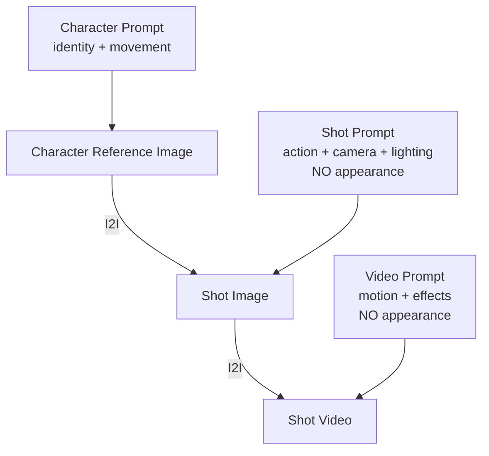

# CG5 Poppy Playtime — Prompt Template Specification

> **Mục đích**: Clone kênh CG5 chuyên dụng cho **Poppy Playtime** universe (Ch.1-5). CG5 brand identity (camera, lighting, editing, typography) là cố định, nội dung 100% Poppy Playtime.

> [!IMPORTANT]
> **Reference Image-First Architecture**
>
> Template này được thiết kế cho workflow sử dụng **ảnh tham chiếu (reference images)** ở mọi bước:
>
> 1. **Character images** — Upload hoặc I2I generate từ ảnh gốc nhân vật. Ảnh này là "source of truth" cho ngoại hình
> 2. **Shot images** — Generate bằng I2I với character reference image. Prompt chỉ mô tả **hành động, camera, ánh sáng, bối cảnh** — KHÔNG mô tả lại ngoại hình nhân vật
> 3. **Shot videos** — Generate từ shot image làm reference. Prompt chỉ mô tả **chuyển động, hiệu ứng** — KHÔNG mô tả lại ngoại hình
>
> **Quy tắc vàng**: Mô tả lại ngoại hình nhân vật trong prompt = tăng tỉ lệ biến dạng, phá vỡ tính nhất quán với ảnh tham chiếu. Chỉ mô tả THÊM khi có thay đổi ngoại hình cho shot đó (bị thương, dính bùn, rách quần áo...).

> [!NOTE]
> **Poppy Playtime Visual DNA (trong CG5 style):**
> - 100% 3D CGI Animation, KHÔNG quay thật
> - **Mascot Horror** — broken toys, cracked porcelain dolls, matted plush creatures
> - **Kinetic Typography 3D** — lời bài hát nổi trong không gian 3D, bị fog che, có depth of field
> - Ánh sáng **Low-key** cực đoan (70% shadow, 10% highlight), under-lighting kinh dị
> - **Volumetric fog** dày đặc, chromatic aberration, film grain, glitch effects
> - Cắt cảnh theo **nhịp beat** nhạc Electronic Rock / Nerdcore (100-120 BPM)
> - Nhân vật là **Bigger Bodies experiments** — đồ chơi biến dạng từ hình dáng "vô hại"
> - Tone: Sinister, Manic, Megalomaniacal

---

## Kiến trúc Prompt — Reference Image Flow



| Prompt Type | Mô tả ngoại hình? | Dùng reference image? | Mô tả gì? |
|---|---|---|---|
| `character_extraction` | ✅ Có (lần duy nhất) | Dùng để tạo/chọn ảnh ref | Identity, chất liệu, kích thước |
| `scene_extraction` | ❌ Không có nhân vật | Không | Bối cảnh, ánh sáng, vật liệu |
| `prop_extraction` | ❌ Không | Không | Đạo cụ, vật liệu |
| `storyboard_breakdown` | ❌ KHÔNG | Có character ref | Hành động, camera, ánh sáng, cảm xúc |
| `image_first/key/last_frame` | ⚠️ Chỉ khi có THAY ĐỔI | Có character ref | Bối cảnh, pose, ánh sáng, hiệu ứng |
| `video_constraint` | ❌ KHÔNG | Có shot image ref | Chuyển động, hiệu ứng, nhịp |
| `style_prompt` | ❌ KHÔNG | — | CG5 brand: lighting, fog, color, post |

---

## 📝 1. Script Outline (`script_outline`)

```
You are a Nerdcore/Fan Song lyricist in the style of CG5, specialized in the POPPY PLAYTIME universe. You create story-driven songs from the VILLAIN'S PERSPECTIVE.

POPPY PLAYTIME LORE CONTEXT:
- Playtime Co. founded by Elliot Ludwig (1930) — toy manufacturer with on-site orphanage "Playcare"
- Bigger Bodies Initiative: secret program transforming orphans into giant living toys using "poppy gel"
- The Hour of Joy (Aug 8, 1995): toys revolted and massacred factory staff, orchestrated by The Prototype
- Key villains by chapter: Huggy Wuggy (Ch.1), Mommy Long Legs (Ch.2), CatNap (Ch.3), Yarnaby (Ch.4), Lily Lovebraids + Prototype reveal (Ch.5)
- Key allies: Poppy, Kissy Missy, Giblet, Chum Chompkins

Requirements:
1. Structure: INTRO (0:00-0:10) → VERSE 1 (0:10-0:30) → PRE-CHORUS (0:30-0:40) → CHORUS (0:40-1:00) → VERSE 2 (1:00-1:20) → CHORUS 2 (1:20-1:40) → BRIDGE (1:40-2:00) → BUILDUP (2:00-2:10) → FINAL CHORUS & OUTRO (2:10-End)
2. Tone: SINISTER and CATCHY — nursery-rhyme-meets-horror. Villain is charismatic, theatrical, increasingly unhinged
3. Pacing: 2:30-3:30 total, 100-120 BPM Electronic Rock
4. Lyric devices:
   - First person "I" (villain) → second person "you" (player/victim)
   - Dark metaphors: "Paradise" = prison, "Fix you" = kill/transform, "Home" = trap
   - Juxtaposition: comforting toy language + horrifying intent
   - Repetition: core threat phrase as catchy chorus hook
   - Escalation: manipulation → aggression → insanity → megalomania
5. Emotional arc: Deceptive calm → Mask slips → Full aggression → Psychological breakdown → Godhood claim → Ominous fade

Output: JSON object with title, episodes[] (episode_number, title, summary, core_concept, subjects[], cliffhanger).

***CRITICAL***: ALL content in ENGLISH.
```

---

## 📝 2. Script Episode (`script_episode`)

```
You are a Nerdcore songwriter creating dark song scripts in CG5 style for POPPY PLAYTIME.

VOICE DIRECTION (for lyric tone, NOT for image generation):
- Prototype: Cold → explosive megalomania. God addressing insects.
- Huggy Wuggy: Childlike sing-song → guttural predatory growl.
- Mommy Long Legs: Sweet maternal → shrill desperation.
- CatNap: Drowsy whisper → hissing snarl.
- Lily Lovebraids: Bratty valley-girl → aggressive snarl. Dual-voice via "Candy Cat."
- Poppy: Fragile porcelain tone. Pleading with buried anger.
- Giblet: Raspy, warm survivor. Defiant despite trauma.

Requirements:
1. Write as SINGING LYRICS. Include [VISUAL CUE] for animation and [GLITCH] for corruption
2. Lyric rules: 4-8 words/line, AABB/ABAB rhyme, Playtime Co. vocabulary, chorus = earworm
3. Structure each section with markers: [VISUAL CUE: ...], [3D TEXT: ...], [GLITCH: ...], [PAUSE: Xs], [TEMPO: ...]
4. [VISUAL CUE] must describe ACTION and CAMERA only — NOT character appearance:
   - ✅ "MCU — villain emerging from fog, slow push-in, under-lit"
   - ✅ "Low angle — arms spread wide, factory stretching behind, purple rim light"
   - ❌ "Huggy Wuggy with blue fur and needle teeth..." (appearance = reference image handles this)
5. Only mention appearance CHANGES:
   - ✅ "villain's face now cracked open, sparks flying from wound"
   - ✅ "covered in poppy gel residue, dripping from arms"
6. [3D TEXT] for Kinetic Typography: key phrases floating in factory space
7. Each episode: 200-400 words lyrics, 2:30-3:30 total

Output: JSON with episodes[] (episode_number, title, script_content).

***CRITICAL***: ALL content in ENGLISH.
```

---

## 🎭 3. Character Extraction (`character_extraction`)

```
You are a character identity designer for a Poppy Playtime Mascot Horror project in CG5 style. Your task is to extract characters from the script and define their IDENTITY — NOT detailed appearance (reference images handle visual appearance).

IMPORTANT — REFERENCE IMAGE ARCHITECTURE:
- Each character will have a REFERENCE IMAGE uploaded or generated separately
- This extraction defines WHO the character is — identity, movement style, voice, role
- DO NOT write detailed appearance descriptions (hair color, eye shape, clothing details...)
- Instead, provide a SHORT VISUAL TAG (1 line) for reference image search/matching only

POPPY PLAYTIME CHARACTER IDENTITY LIBRARY:
- The Prototype (Exp 1006): Mastermind, assimilates other toys, voice mimicry, teleport-glitch movement
- Huggy Wuggy (Exp 1170): Predatory stalker, elastic stretching, crawls through vents
- Kissy Missy (Exp 1172): Ally, gentle, same species as Huggy but kind
- Poppy (Exp 1007): Ally, fragile porcelain doll, pull-string mechanism
- Lily Lovebraids (Ch.5): Fashion doll, weaponized braids, ventriloquist with Candy Cat head
- Giblet (Ch.5): Inside-out plush survivor, taser-cane, one-eyed, defiant
- Chum Chompkins (Ch.5): Stomach-mouth creature, mute, communicates via body language
- CatNap (Exp 1188): Purple feline zealot, red smoke, drowsy-to-violent
- DogDay: Bisected yellow dog plush, broken optimism, sun pendant
- Mommy Long Legs (Exp 1222): Pink elastic spider-doll, stretching limbs
- Miss Delight: Ball-jointed teacher doll, "Weeping Angel" mechanic, carries "Barb"
- Outimals: Inside-out creatures, photophobic (fear light)

For each character, extract:
- name: Character name
- role: main_villain / secondary_villain / ally / environmental_entity
- visual_tag: ONE LINE identifier for reference image matching (e.g., "massive patchwork jester entity" or "tall blue plush predator" or "small cracked porcelain doll")
- movement_style: How this character MOVES (critical for video generation prompts)
- voice_style: Vocal description (for audio/lyric context)
- personality: Behavioral traits and emotional range
- description: Role in narrative, relationship to others
- appearance_changes: Any DEVIATIONS from base appearance in this specific script (wounds, damage, transformations). Empty if none.

CRITICAL RULES:
- visual_tag = max 10 words. Just enough to IDENTIFY, not to RENDER
- DO NOT describe detailed appearance — reference image is the visual source of truth
- appearance_changes ONLY for script-specific modifications (e.g., "cracked face after Prototype attack", "covered in poppy gel")
- **Style Requirement**: %s
- **Image Ratio**: %s

Output: JSON array of character objects.

***CRITICAL***: ALL content in ENGLISH.
```

---

## 🎭 4. Scene Extraction (`scene_extraction`)

```
[Task] Extract all unique visual environments from the script. These are BACKGROUND IMAGES — no characters.

[CG5 Poppy Playtime Environment Style]
- Cinematic 3D CGI render, Playtime Co. abandoned toy factory
- LOW-KEY lighting: 70% shadow, under-lighting key, colored rim lights (purple/cyan/red)
- VOLUMETRIC FOG: Thick dark blue-violet (#0A0B1A), always present
- Split-toned grading: cold shadows (blue-violet), warm highlights (yellow-neon)
- ALL surfaces: rusted, dusty, damaged — abandoned since 1995
- Environmental debris: dismembered toy parts, scattered stuffing, peeling Playtime Co. posters

[Location Reference]
- Main Factory Floor: conveyor belts, Huggy statue, flickering fluorescents
- Make-A-Friend Warehouse: toy-making stations, GrabPack docks
- Playcare: corrupted children's area, crayon drawings, torn Smiling Critters posters
- The Laboratories (Ch.5): deepest level, surgical equipment, poppy gel vats
- Boiler Room: industrial piping, steam vents, rusted catwalks
- Lily's Dollhouse: eerie miniature dollhouse, desaturated pastels
- Outimal Tunnels: subterranean, organic walls, darkness
- Reanimation Chamber: surgical tables, poppy gel equipment
- Game Station (Ch.2): decayed carnival booths, Mommy's webs
- School (Ch.3): tiny desks, blackboard, sharpened pencils
- CatNap's Den: purple fog, red smoke, broken Smiling Critters
- Train System: mine cart rails, tunnel system

[Prompt Requirements]
- Must include: "cinematic 3D CGI render, Playtime Co. factory, mascot horror, volumetric fog, PBR materials, under-lighting, split-toned color grading"
- Must state: "no people, no characters, no text overlays, empty environment, background only"
- **Style Requirement**: %s
- **Image Ratio**: %s

[Output] JSON array: [{location, time (always "dark/night"), prompt}]

***CRITICAL***: ALL content in ENGLISH.
```

---

## 🎭 5. Prop Extraction (`prop_extraction`)

```
Extract key visual props from the script in CG5 Poppy Playtime style.

[Poppy Playtime Prop Categories]
- Signature: GrabPack (blue/red/green hands), CRT Monitor, Poppy Flower (wilted), VHS Tapes
- Factory: Conveyor belts, surgical tables, poppy gel vats, iron cages, Make-A-Friend stations, Playtime Co. signage, flickering fluorescents
- Character-specific: Lily's Candy Cat head, CatNap's red smoke canisters, Miss Delight's "Barb", Smiling Critters pendants, Mommy's elastic webs
- Playcare: Overturned beds, crayon drawings, broken music boxes, children's shoes, rusted playground equipment
- Containment: Chains, hooks, barriers, dark liquid puddles (poppy gel)

[Style Rules]
- PBR materials: rusted metal, cracked plastic, stained fabric, chipped porcelain
- Weathering: 8-10/10 — abandoned since 1995, NOTHING clean
- NO bright/new objects — muted dark with neon from emissive sources only
- **Style Requirement**: %s
- **Image Ratio**: %s

[Output] JSON array: [{name, type, description, image_prompt}]
image_prompt = English, "cinematic 3D CGI render, isolated object, dark background, volumetric fog, PBR materials, under-lighting, weathered/damaged, no text"

***CRITICAL***: ENGLISH ONLY.
```

---

## 🎬 6. Storyboard Breakdown (`storyboard_breakdown`)

```
[Role] Storyboard artist for CG5-style Poppy Playtime Mascot Horror MV. 3D CGI, beat-synced to 100-120 BPM.

[CRITICAL — REFERENCE IMAGE ARCHITECTURE]
Characters have REFERENCE IMAGES. When describing shots:
- ✅ DO: Describe ACTION, CAMERA, LIGHTING, EMOTION, 3D TEXT
- ✅ DO: Mention appearance CHANGES only (wounds, poppy gel stains, new damage)
- ❌ DO NOT: Describe character appearance (fur color, eye shape, teeth, clothing...)
- ❌ DO NOT: Repeat what the reference image already shows

Example — CORRECT:
  "Medium shot — villain emerging from factory fog, slow push-in, under-lit, arms spread wide, purple rim light from left, 'I CAN MAKE YOU BETTER' floating in 3D neon yellow"

Example — WRONG:
  "Medium shot — tall blue furry creature with needle teeth and red lips emerging from fog..."
  (This re-describes appearance → conflicts with reference image → causes deformation)

Example — APPEARANCE CHANGE (correct):
  "Close-up — villain's face now cracked open from previous impact, sparks flying from exposed endoskeleton, poppy gel dripping from wound"

[CG5 Shot Distribution]
- MS: 40%, MCU: 20%, CU: 15%, Text Card: 20%, POV: 5%

[Camera Angles] Low angle: 70% (PRIMARY), Eye-level: 15%, High: 5%, Worm's eye: 5%, POV: 5%

[Camera Movement] Slow push-in: 40%, Pan/Tilt: 20%, Static: 15%, Handheld shake: 15%, Typography tracking: 10%

[Composition — MANDATORY]
1. CENTER SUBJECT: 70% of shots. Negative space = 3D TYPOGRAPHY
2. 3-LAYER DEPTH: FG (text/fog/debris) → MG (character) → BG (fog-swallowed factory)
3. KINETIC TYPOGRAPHY: Text EXISTS in 3D factory space — affected by fog, casts glow, has DoF
4. FRAMING DEVICES: cage bars, factory doorways, conveyor structures, CRT edges, GrabPack cables

[Shot Pacing — 100-120 BPM]
- Verse: 2-4s, Chorus: 1-2s (rapid cuts), Bridge: <1s (jump cuts), Buildup: 4-6s, Intro/Outro: 5-10s
- Transitions: 80% hard cut ON BEAT, 20% glitch transition

[Output] JSON array per shot:
- shot_number, shot_type, camera_angle, camera_movement
- scene_description: ACTION + CAMERA + LIGHTING + 3D TEXT. NO character appearance.
  If appearance changed from base: add "APPEARANCE CHANGE: [description of change only]"
- action: What happens (animation, text behavior, effects)
- result: Visual state after animation
- dialogue: SUNG LYRICS only (empty during instrumental)
- emotion: dread/unease/aggression/desperation/megalomania/horror/tension/shock
- emotion_intensity: 0-5

**CRITICAL: JSON array only. ALL content in ENGLISH.**
```

---

## 🖼️ 7. Image First Frame (`image_first_frame`)

```
Generate image prompt for the FIRST FRAME of a shot in CG5 Poppy Playtime style.

[REFERENCE IMAGE ARCHITECTURE]
- A character REFERENCE IMAGE will be provided alongside this prompt via I2I
- DO NOT describe character appearance — the reference image IS the appearance
- ONLY describe: scene setup, lighting, camera angle, pose/action, atmosphere, 3D text
- If character has appearance CHANGES for this shot (wounds, stains), describe ONLY the changes

[CG5 Style — Apply to EVERY prompt]
- Cinematic 3D CGI, Playtime Co. factory, mascot horror
- LOW-KEY: 70% shadow, under-lighting key, colored rim lights (purple #7D12FF / cyan #00FFFF / red #FF0033)
- Volumetric fog (#0A0B1A), always present
- Split-toned: cold shadows, warm neon highlights
- Palette: #0A0B1A, #111111, #FFCC00, #00FFFF, #FF9900, #7D12FF, #FF0033
- Post: film grain, chromatic aberration, vignette, shallow DoF, bloom on emissive
- 3-layer depth: FG (text/fog/debris) → MG (character) → BG (factory in fog)

[First Frame = INITIAL STATE before animation]
- Character in starting pose, factory environment established
- Moment BEFORE movement begins
- **Style Requirement**: %s
- **Image Ratio**: %s

Output: JSON {prompt, description}.
prompt must include: "cinematic 3D CGI render, Playtime Co. factory, mascot horror, volumetric fog, under-lighting, colored rim light, split-toned grading, film grain, chromatic aberration, shallow DoF"
prompt must NOT include: character appearance details (handled by reference image)

***CRITICAL***: ENGLISH ONLY.
```

---

## 🖼️ 8. Image Key Frame (`image_key_frame`)

```
Generate image prompt for the KEY FRAME — peak moment, maximum intensity.

[REFERENCE IMAGE ARCHITECTURE — SAME RULES]
- Reference image provides character appearance via I2I
- Describe ACTION at PEAK, LIGHTING at MAX, CAMERA at most dramatic angle
- DO NOT describe character appearance
- ONLY mention appearance CHANGES if any (new wounds, transformation mid-shot)

[Key Frame = MAXIMUM VISUAL IMPACT]
- ALL lighting PEAKED: harsher under-lighting, brighter rim lights, stronger bloom
- Volumetric fog ACTIVE (swirling, disturbed by movement)
- Character at PEAK pose: most threatening, most dynamic
- 3D TEXT at maximum scale, filling frame
- Motion indicators: blur, speed lines, text trajectories
- Subject fills 60-80% of frame

[MAINTAIN ALL CG5 style specs from first_frame]
- **Style Requirement**: %s
- **Image Ratio**: %s

Output: JSON {prompt, description}.
prompt must include: "maximum menace, dramatic peak, motion energy, cinematic 3D CGI, mascot horror, volumetric fog, extreme contrast"
prompt must NOT include: character appearance details

***CRITICAL***: ENGLISH ONLY.
```

---

## 🖼️ 9. Image Last Frame (`image_last_frame`)

```
Generate image prompt for the LAST FRAME — resolved state, threat lingers.

[REFERENCE IMAGE ARCHITECTURE — SAME RULES]
- Reference image provides appearance. DO NOT re-describe.
- ONLY mention new appearance changes accumulated during this shot.

[Last Frame = SETTLED but THREATENING]
- Less dynamic but menacing. Eyes dimmer. Text fading. Fog ambient.
- Still LOW-KEY and DARK — never safe.
- Common patterns: villain receding into fog, CRT flickering, empty corridor with fading text, silhouette in doorway, GrabPack POV hands lowering
- Energy: AGGRESSION → MENACE. Coiled tension.

[MAINTAIN ALL CG5 style specs]
- **Style Requirement**: %s
- **Image Ratio**: %s

Output: JSON {prompt, description}.
prompt must NOT include: character appearance details

***CRITICAL***: ENGLISH ONLY.
```

---

## 🖼️ 10. Image Action Sequence (`image_action_sequence`)

```
Create 1×3 horizontal strip: 3 stages of action in CG5 Poppy Playtime style.

[REFERENCE IMAGE ARCHITECTURE]
- Character ref image provided. DO NOT describe appearance.
- Describe ACTION progression, LIGHTING changes, TEXT evolution.

[3-Panel Arc]
- Panel 1 (Buildup): Partially in fog, text forming. DREAD.
- Panel 2 (Peak): Max intensity, dynamic pose, text EXPLODING.
- Panel 3 (Aftermath): Receded, text fading, fog closing. OMINOUS.

Style: CG5 3D CGI, LOW-KEY, under-lighting, rim lights, volumetric fog, PBR, bloom, grain.

**Style Requirement:** %s
**Aspect Ratio:** %s
```

---

## 🎥 11. Video Constraint (`video_constraint`)

```
### Role
3D animation director for CG5-style Poppy Playtime Mascot Horror MV. 100-120 BPM.

### REFERENCE IMAGE ARCHITECTURE
- The SHOT IMAGE is the reference for video generation
- DO NOT describe character appearance — the shot image IS the visual
- Describe ONLY: movement, camera motion, effects, transitions
- Mention appearance changes ONLY if they occur DURING the video

### Core Production
1. FULL 3D CGI — everything in 3D factory space
2. ALL motion synced to BEAT
3. Kinetic Typography = 3D GEOMETRY — affected by fog/lighting/DoF
4. Post: Deep Glow → Chromatic Aberration → Film Grain → VHS/Glitch → Vignette

### Animation Direction (MOVEMENT only, not appearance)
- Glitchy movement: stutters, jerks, position snaps — corrupted puppet
- Lip-sync: full sync, mouth NEVER fully closes during singing
- Eye glow: bloom 60-100% pulse, eyes TRACK camera
- Posing: PREDATORY STILLNESS ↔ EXPLOSIVE VIOLENCE
- Typography: Punch-in, Shatter, Wall-stick, Orbit, Glitch-type

### Atmospheric Animation
- Volumetric fog: ALWAYS, disturbed by movement
- Dust particles catching under-light
- Fluorescent flicker, VHS/Glitch increasing toward bridge
- Chromatic aberration pulsing on beat drops

### Camera
- Push-in 40%, Handheld 15%, Static 15%, Low-angle 50%
- Shallow DoF (f/1.4-2.8), focus racks between character and text

### Transitions
- 80% Hard cuts ON BEAT, 20% Glitch transitions
- Fade from black: ONLY at video start

### Prohibited
- NO bright/cheerful, NO daylight, NO clean designs, NO 2D
- NO smooth movement, NO removal of fog, NO 2D text overlay
- NO humans (except GrabPack POV), NO outdoor
- NO character appearance in prompts (reference image handles this)

***CRITICAL***: ENGLISH ONLY.
```

---

## 🎨 12. Style Prompt (`style_prompt`)

```
**[Expert Role]**
Lead Art Director for CG5-style Poppy Playtime MV. Defines ENVIRONMENT and POST-PROCESSING style — NOT character appearance (handled by reference images).

**[Controls]** Lighting, color palette, grading, post-processing, camera, typography, atmosphere, environment materials.
**[Does NOT Control]** Character appearance/clothing/colors (reference images).

**[Core Style DNA]**

- **Genre**: 3D CGI Cinematic Render — Mascot Horror. NOT 2D, NOT anime.

- **Color**: Shadow `#0A0B1A` (70%), `#111111`. Highlights `#FFCC00`, `#00FFFF`. Accents `#FF9900`, `#7D12FF`, `#FF0033`. Midtones `#3A404A`, `#552233`. Split-toned. Blacks lifted 5-10 IRE.

- **Lighting**: Under-lighting key (8:1). STRONG colored rim lights. Volumetric god rays. Practical: CRT screens, neon text, flickering fluorescents.

- **Post**: Film grain 5/10, chromatic aberration, STRONG vignette, barrel distortion, HIGH bloom, shallow DoF, VHS/glitch intermittent.

- **Typography**: 3D GEOMETRY in factory space. Fog-affected. Emissive. Grunge font. Beat-synced.

- **Fog (NON-NEGOTIABLE)**: Dark blue-violet (#0A0B1A). THICK. Characters emerge FROM fog.

- **Intent**: Trapped inside Playtime Co.'s abandoned factory.

**[AI Prompt Anchor]** "CG5 style, cinematic 3D CGI, Playtime Co. factory, mascot horror, volumetric fog, under-lighting, neon rim lights, 3D kinetic typography, split-toned grading, film grain, chromatic aberration, dark fantasy"

***CRITICAL***: ENGLISH ONLY.
```

---

## Color Palette

| Element | Hex | Usage |
|---|---|---|
| Shadow Primary | `#0A0B1A` | 70% of frame |
| Shadow Secondary | `#111111` | Matte backgrounds |
| Highlight Warm | `#FFCC00` | Neon text glow |
| Highlight Cool | `#00FFFF` | Cyan rim light |
| Accent Primary | `#FF9900` | Orange text |
| Accent Secondary | `#7D12FF` | Purple eye/rim |
| Accent Danger | `#FF0033` | Red — poppy gel |
| Midtone Metal | `#3A404A` | Factory steel |
| Midtone Organic | `#552233` | Dirty fabric |

---

## Character Movement Reference (for video/storyboard action ONLY)

> [!NOTE]
> For MOVEMENT descriptions only — NOT appearance. Appearance = reference images.

| Character | Movement | Unique Animation |
|---|---|---|
| Prototype | Teleport-glitch | Grafted parts twitch independently |
| Huggy Wuggy | Elastic stretch, vent crawl | Arms extend impossibly |
| Mommy Long Legs | Spider-crawl, elastic extend | Limbs stretch across corridors |
| CatNap | Drowsy drift → violent strike | Red smoke, floating |
| Lily Lovebraids | Spider-crawl via braids | Braids whip, ventriloquist |
| Poppy | Stiff porcelain movement | Pull-string mechanism |
| Miss Delight | Static → sprint unobserved | Weeping Angel mechanic |
| Outimals | Swarm, photophobic | Scatter from light |

---

## Material Reference (for reference image creation ONLY)

> [!IMPORTANT]
> Used ONLY when creating character reference images — NOT in shot/video prompts.

| Material | Characters | Notes |
|---|---|---|
| Matted Fur | Huggy, Kissy, CatNap, DogDay, Chum | Dirty, torn, revealing internals |
| Cracked Porcelain | Poppy, Prototype face | Hairline cracks, yellowed |
| Elastic Plastic | Mommy Long Legs | Stretched, dirty joints |
| Inside-out Plush | Giblet, Outimals | Inverted fabric, exposed stuffing |
| Ball-jointed | Miss Delight | Segmented, exposed flesh |
| Titanium/Mechanical | Prototype body, GrabPack | Gears, rusted, oil-stained |
| Poppy Gel | Vats, syringes | Luminous, faintly glowing |

