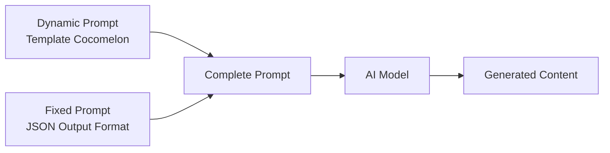
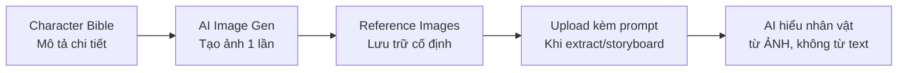

# Cocomelon-Style — Prompt Template Specification

> **Mục đích**: Tạo kênh nursery rhyme 3D CGI Animation theo phong cách Cocomelon (high-end preschool 3D render, tạo hình nhựa/plastic toy, bo tròn cực đại, ánh sáng high-key ấm áp, bảng màu cơ bản siêu bão hòa) với **nhân vật gốc** (Bubi & Mama) để tránh vi phạm bản quyền.

> [!IMPORTANT]
> Đây là **dynamic prompt** — phần thay đổi được của template. Khi hệ thống sử dụng, nó sẽ tự động nối với **fixed prompt** (JSON output format) từ `application/prompts/fixed/`.
> 
> **Prompt hoàn chỉnh = Dynamic prompt (bên dưới) + Fixed prompt (JSON format đã có sẵn)**

> [!CAUTION]
> **Bản quyền — Quy tắc bắt buộc:**
> - KHÔNG sử dụng tên "JJ", "TomTom", "YoYo" hoặc bất kỳ tên nhân vật Cocomelon nào
> - KHÔNG xuất hiện logo dưa hấu (watermelon), bọ rùa (ladybug), hoặc text "Cocomelon" trong ảnh/video
> - Nhân vật chính: **Bubi** (bé, 2 túm tóc tròn nâu, mắt có catchlight hình sao ★)
> - Nhân vật phụ chính: **Mama** (wavy bob chestnut, kẹp hoa 🌸, lavender cardigan)
> - Brand theme: **Cloud & Star** ☁️⭐ (không phải watermelon)

> [!NOTE]
> **Khác biệt chính so với The Countdown Kids:**
> - **3D CGI** (không phải 2D flat vector) — toàn bộ dựng hình 3D, render bề mặt nhựa/cao su mịn
> - **Subsurface scattering** trên da nhân vật — tạo cảm giác da "tươi, mềm"
> - **Bo tròn cực đại** — mọi thứ đều rounded như đồ chơi nhựa cao cấp
> - **High-key studio lighting** tỷ lệ key:fill gần 1:1 — hầu như không có bóng đổ gắt
> - **Lip-sync singing** — nhân vật hát khớp miệng (không phải choir voice-over)
> - **Không có text trên màn hình** — hoàn toàn visual-driven
> - Pacing **chậm hơn** (80-100 BPM), rõ từng âm tiết cho trẻ bắt chước
> - **Narrator = Mama voice** ấm áp + Bubi child voice (không phải choir)
> - Transitions chủ yếu **Hard cut** (90%) + Cross dissolve — không có Iris crop
> - **Branded transitions**: Star sparkle wipe ✨ hoặc cloud dissolve ☁️

---

## Kiến trúc Prompt trong hệ thống



| Prompt Type | Dynamic Prompt (template) | Fixed Prompt (system) |
|---|---|---|
| `style_prompt` | Art Direction guidelines | *(không có fixed riêng)* |
| `character_extraction` | Extraction rules + style | JSON array format + examples |
| `scene_extraction` | Scene rules + style | JSON format + rules |
| `prop_extraction` | Prop rules + style | JSON array format |
| `storyboard_breakdown` | Shot breakdown rules | JSON array format + field specs |
| `script_outline` | Outline writing rules | JSON object format |
| `script_episode` | Episode script rules | JSON object format |
| `image_first_frame` | Image gen guidelines | JSON {prompt, description} format |
| `image_key_frame` | Image gen guidelines | JSON {prompt, description} format |
| `image_last_frame` | Image gen guidelines | JSON {prompt, description} format |
| `image_action_sequence` | 1×3 strip rules | JSON {prompt, description} format |
| `video_constraint` | Video gen constraints | *(không có fixed riêng)* |

---

## 🎭 Character Bible — Bảng mô tả nhân vật chi tiết

> [!IMPORTANT]
> Section này dùng để **tạo ảnh tham chiếu (reference image) 1 lần duy nhất** cho mỗi nhân vật.
> Sau khi tạo xong, các prompt khác sẽ **upload ảnh tham chiếu** thay vì lặp lại mô tả text.
> Quy trình: Character Bible → Gen ảnh → Lưu ảnh → Upload làm visual reference khi cần.



### Quy tắc chung toàn bộ nhân vật

- **Render style**: 3D CGI, Cocomelon-inspired — premium plastic toy aesthetic
- **Geometry**: Cực kỳ bo tròn, không có cạnh sắc, bề mặt semi-glossy
- **Skin**: Smooth, poreless, SUBSURFACE SCATTERING — da phát sáng nhẹ từ bên trong
- **Eyes**: Rất to, có **STAR-SHAPED CATCHLIGHTS (★)** — Bubi có mắt TO NHẤT, các nhân vật khác nhỏ dần theo vai trò
- **Expression**: Luôn tích cực — cười to, mắt lấp lánh. Chỉ có lo lắng nhẹ thoáng qua
- **Material**: Toàn bộ bề mặt giống nhựa/cao su cao cấp, specular highlights nhẹ
- **Lighting cho ảnh ref**: High-key studio, nền trắng, T-pose, character turnaround (front/side/back/3/4)
- **KHÔNG có text, logo, watermark** trong ảnh reference

### Visual Hierarchy — Bubi luôn nổi bật nhất

| Quy tắc | Bubi (chủ) | Nhân vật phụ |
|---|---|---|
| **Màu sắc** | **Vàng sáng nhất** (#FFE156) — bão hòa nhất trên màn hình | Tông pastel, muted, cool hơn |
| **Hình khối** | **Tròn nhất** — đầu trọc = hình tròn hoàn hảo | Có tóc = phá vỡ hình tròn |
| **Chi tiết** | **Ít chi tiết nhất** — bald + romper đơn sắc | Nhiều chi tiết hơn (tóc, phụ kiện) |
| **Mắt** | **Mắt TO NHẤT** + star catchlights lớn nhất | Mắt nhỏ hơn theo tỷ lệ |

### Bảng ánh xạ Tên → Descriptor (cho image/video prompt output)

> [!IMPORTANT]
> Khi sinh **shot image prompt** hoặc **shot video prompt**, KHÔNG được gọi tên nhân vật (AI tạo ảnh không biết "Bubi" là ai).
> Thay vào đó dùng **descriptor** mô tả đặc điểm nhận dạng. Ảnh tham chiếu sẽ được upload kèm nên KHÔNG cần mô tả chi tiết ngoại hình.

| Tên (dùng trong script/storyboard) | Descriptor (dùng trong image/video prompt) |
|---|---|
| Bubi | a bald toddler in yellow romper with lightning bolt symbol |
| Mama | a woman with wavy brown bob and flower hair clip, lavender cardigan |
| Papa | a man with round glasses and blue-grey shirt |
| Luli | a girl with side ponytail in coral dress |
| Mochi | a chubby white cat |
| Nana | an elderly woman with white hair bun and floral apron |
| Popo | an elderly man with white mustache, round glasses and flat cap |
| Ziggy | a dark-skinned toddler with afro in purple shirt |
| Mei | a toddler girl with black braids and yellow bows, pink top |
| Rio | a curly-haired toddler in green shirt |
| Teacher Sunny | an auburn-haired woman in gold cardigan with star hair clip |

---

### 1. BUBI — Nhân vật chính (Main Toddler)

| Thuộc tính | Mô tả |
|---|---|
| **Vai trò** | Nhân vật chính, xuất hiện MỌI episode. Toddler ~2 tuổi |
| **Giới tính** | Trung tính (unisex) — cả bé trai/gái đều đồng cảm được |
| **Đầu (ICONIC)** | **HOÀN TOÀN TRỌC** — tròn mịn hoàn hảo, không có tóc. Tỷ lệ head:body ~1:1.8. Đầu trọc tạo silhouette tròn nhất và đơn giản nhất trong cast |
| **Mắt (ICONIC)** | TO NHẤT trong cast (~35% diện tích mặt). Star-shaped catchlights ★ lớn nhất. Ánh mắt sáng, tò mò |
| **Má (ICONIC)** | **Má mochi** — cực tròn phính, rosy blush ấm, SSS glow mạnh. Tròn hơn mọi nhân vật khác |
| **Da** | **Warm honey (#E8C99B)** với SSS glow mạnh nhất. Đầu trọc = hiển thị SSS rõ nhất |
| **Mũi** | Tròn nhỏ xíu, gần như không thấy |
| **Miệng** | Nhỏ, cong cười. Mở to tròn khi hát/ngạc nhiên |
| **Thân** | CỰC KỲ MŨM MĨM, tròn trĩnh nhất trong cast. Chi ngắn và dày |
| **Trang phục (ICONIC)** | **Romper vàng sáng (#FFE156)** với biểu tượng **tia sét xanh ⚡** nhỏ trên ngực. Màu vàng sáng nhất = luôn nổi bật nhất |
| **Trang phục phụ** | Áo mưa + ủng (outdoor), Đồ ngủ hoa văn sao (bedtime) — luôn giữ tông vàng |
| **Giọng nói** | Giọng trẻ con cao, nhiệt tình, rõ từng âm tiết, 80-100 BPM |
| **Tính cách** | Tò mò, hay cười, nhiệt tình. Nhảy nhẹ theo nhạc, nghiêng đầu khi tò mò |

**Prompt tạo ảnh reference Bubi:**
```
character turnaround sheet, T-pose, front view, side view, back view, 3/4 view, full body, white background, no text overlay. 3D CGI render, premium plastic toy aesthetic, Pixar preschool design. Smooth bald toddler approximately 2 years old, unisex, perfectly round smooth head with no hair. Giant expressive eyes with star-shaped catchlights, largest eyes in the cast. Soft mochi cheeks with warm rosy blush, subsurface scattering glow. Warm honey skin (#E8C99B). Tiny button nose, wide joyful smile. Bright YELLOW ROMPER (#FFE156) with small BLUE LIGHTNING BOLT symbol on chest. Extra chubby rounded body, very short thick limbs, head to body ratio 1:1.8, extremely rounded geometry, semi-glossy surfaces, 8k render, masterpiece quality
```

---

### 2. MAMA — Mẹ

| Thuộc tính | Mô tả |
|---|---|
| **Vai trò** | Mẹ của Bubi và Luli. Narrator chính, xuất hiện ~80% episodes |
| **Tóc** | **Wavy bob** ngang vai, **chestnut brown (#8B6B4A)**. Có **kẹp hoa** 🌸 soft pink (#FF9EC6) bên phải — identifier |
| **Mắt** | To nhưng nhỏ hơn Bubi. Star catchlights nhỏ hơn. Ánh mắt ấm áp, dịu dàng |
| **Da** | Warm honey (#E8C99B), SSS |
| **Trang phục** | **Lavender cardigan (#C8A2C8)** khoác ngoài áo kem — pastel, muted, KHÔNG cạnh tranh vàng |
| **Tính cách** | Luôn nuôi dưỡng — cười dịu, gật đầu khuyến khích |

**Prompt tạo ảnh reference Mama:**
```
character turnaround sheet, T-pose, front view, side view, back view, 3/4 view, full body, white background, no text overlay. 3D CGI render, premium plastic toy aesthetic, Pixar preschool design. Adult female, mother figure. Shoulder-length wavy bob hair, chestnut brown (#8B6B4A). Small pink flower hair clip (#FF9EC6) on right side. Large warm eyes with small star-shaped catchlights, gentle expression. Warm honey skin (#E8C99B) with subsurface scattering. Soft smile. Soft lavender cardigan (#C8A2C8) over cream white top. Rounded proportional body, taller than toddler. Desaturated warm palette, extremely rounded geometry, semi-glossy surfaces, 8k render
```

---

### 3. PAPA — Bố

| Thuộc tính | Mô tả |
|---|---|
| **Vai trò** | Bố của Bubi và Luli. Dạy qua HÀNH ĐỘNG. Xuất hiện ~50% episodes |
| **Tóc** | Ngắn, xoăn nhẹ, **dark brown (#4A3728)** |
| **Mắt** | Star catchlights nhỏ. Đeo **kính tròn** — identifier |
| **Da** | Warm honey (#E8C99B), SSS |
| **Trang phục** | **Áo xanh-xám muted (#7B9EAE)** cuộn tay, quần khaki — cool toned, lùi về sau |
| **Tính cách** | "Vụng về dễ thương" — hay làm rơi đồ nhưng luôn cố gắng |

**Prompt tạo ảnh reference Papa:**
```
character turnaround sheet, T-pose, front view, side view, back view, 3/4 view, full body, white background, no text overlay. 3D CGI render, premium plastic toy aesthetic, Pixar preschool design. Adult male, father figure. Short slightly curly dark brown hair (#4A3728). Round simple glasses with thin frames. Large eyes with small star-shaped catchlights behind glasses, friendly expression. Warm honey skin (#E8C99B) with subsurface scattering. Wide easy smile. Muted blue-grey shirt (#7B9EAE) with rolled-up sleeves, light khaki pants. Stocky rounded body, slightly larger than Mama. Cool earthy palette, extremely rounded geometry, semi-glossy surfaces, 8k render
```

---

### 4. LULI — Chị gái (~6 tuổi)

| Thuộc tính | Mô tả |
|---|---|
| **Vai trò** | Chị gái của Bubi (~6 tuổi). "Người dẫn đường". Xuất hiện ~40% episodes |
| **Tóc** | **Ponytail 1 bên** (bên phải), chocolate brown (#6B3A2A). Mềm, bouncy |
| **Mắt** | To, star catchlights nhỏ. Sáng, tinh nghịch |
| **Da** | Warm honey (#E8C99B), SSS |
| **Thân** | Mũm mĩm nhưng cao hơn Bubi, ÍT TRÒN hơn — Bubi vẫn là "quả bóng" nhất |
| **Trang phục** | **Váy coral nhạt (#E8907E)** tay áo phồng — warm nhưng KHÔNG sáng bằng vàng |
| **Tính cách** | Hay bày trò, sáng tạo, đôi khi bossy nhưng luôn bảo vệ Bubi |

**Prompt tạo ảnh reference Luli:**
```
character turnaround sheet, T-pose, front view, side view, back view, 3/4 view, full body, white background, no text overlay. 3D CGI render, premium plastic toy aesthetic, Pixar preschool design. Young girl approximately 6 years old, older sister. Chocolate brown hair (#6B3A2A) in simple side ponytail on right side, soft and bouncy. Large eyes with small star-shaped catchlights, playful expression. Warm honey skin (#E8C99B) with subsurface scattering. Cheerful grin. Soft coral dress (#E8907E) with simple short puffy sleeves. Chubby but less round than toddler protagonist, slightly taller with longer limbs. Extremely rounded geometry, semi-glossy surfaces, 8k render
```

---

### 5. MOCHI — Thú cưng (Mèo)

| Thuộc tính | Mô tả |
|---|---|
| **Vai trò** | Mèo nhà. Comic relief. Xuất hiện ~60% episodes |
| **Hình dáng** | Mèo trắng mập tròn, tai tròn nhỏ, đuôi ngắn xù |
| **Mắt** | To, tròn, **xanh ngọc (#40E0D0)**. Catchlight **TRÒN** (KHÔNG phải sao — phân biệt với nhân vật người) |
| **Lông** | Trắng tinh (#FFFFFF), mịn, semi-glossy. NHỎ hơn Bubi |
| **Tính cách** | Không nói, chỉ "meo". Hay ngủ chỗ kỳ lạ. Đẩy đồ rơi khỏi bàn |

**Prompt tạo ảnh reference Mochi:**
```
character turnaround sheet, front view, side view, back view, 3/4 view, full body, white background, no text overlay. 3D CGI render, premium plastic toy aesthetic, Pixar preschool design. Chubby white cat, family pet. Cloud-shaped body, very round and puffy like a marshmallow. Small round ears, short fluffy tail. Large turquoise eyes (#40E0D0) with ROUND catchlights only, not star-shaped. Pure white fur (#FFFFFF), smooth semi-glossy plastic texture. Cute sleepy expression. No clothing. Smaller than the toddler protagonist. Extremely rounded geometry, semi-glossy surfaces, 8k render
```

---

### 6. NANA — Bà

| Thuộc tính | Mô tả |
|---|---|
| **Vai trò** | Bà. Nhân vật "kể chuyện" — khi Nana xuất hiện, episode có phần story-within-story. Xuất hiện ~20% episodes |
| **Tóc (ICONIC)** | Tóc bạc trắng búi thành **1 búi tròn lớn** (1 giant puff) — evolution ngược: Bubi 2, Luli 3, Nana 1 giant = "wise, concentrated" |
| **Mắt** | Nhỏ hơn các nhân vật trẻ, star catchlights. Ánh mắt ấm áp |
| **Da** | Warm honey đậm hơn nhẹ (#D4A76A), SSS |
| **Thân** | Tròn, nhỏ nhắn, thấp hơn Mama |
| **Trang phục** | **Tạp dề hoa** (pattern hoa match kẹp hoa của Mama — genetic trait). Áo len ấm màu kem |
| **Phụ kiện** | Kính lão nhỏ đeo trễ mũi |
| **Tính cách** | Hiền hậu, hay ôm, luôn mang theo bánh/đồ ăn. Giọng kể chuyện chậm rãi |

**Prompt tạo ảnh reference Nana:**
```
character turnaround sheet, T-pose, front view, side view, back view, 3/4 view, full body, white background, no text overlay. 3D CGI render, premium plastic toy aesthetic, Pixar preschool design. Elderly female, grandmother figure. Silver-white hair in simple low bun at back of head. Small warm eyes with tiny star-shaped catchlights, small round reading glasses low on nose. Warm honey skin slightly deeper (#D4A76A) with subsurface scattering. Gentle warm smile, soft rosy cheeks. Cream-colored knit sweater with muted floral apron. Short rounded body, shorter than Mama. Earthy desaturated palette, extremely rounded geometry, semi-glossy surfaces, 8k render
```

---

### 7. POPO — Ông

| Thuộc tính | Mô tả |
|---|---|
| **Vai trò** | Ông. Nhân vật "âm nhạc" — khi Popo xuất hiện, episode có nhiều nhạc cụ hơn. Xuất hiện ~20% episodes |
| **Tóc** | Hói nhẹ trên đỉnh, tóc bạc hai bên |
| **Mặt (ICONIC)** | **Ria mép tròn dày** trắng bạc — brand identifier. Đeo **kính tròn giống Papa** nhưng to hơn — genetic trait (con giống bố) |
| **Da** | Warm honey đậm hơn nhẹ (#D4A76A), matching Nana |
| **Thân** | Tròn, bụng phệ nhẹ, cao hơn Nana |
| **Trang phục** | **Mũ beret** vải xám, áo vest màu nâu ấm, nơ bướm nhỏ |
| **Phụ kiện** | Luôn có ukulele hoặc nhạc cụ gần bên |
| **Tính cách** | Vui nhộn, hay đùa, luôn hát/chơi nhạc cụ |

**Prompt tạo ảnh reference Popo:**
```
character turnaround sheet, T-pose, front view, side view, back view, 3/4 view, full body, white background, no text overlay. 3D CGI render, premium plastic toy aesthetic, Pixar preschool design. Elderly male, grandfather figure. Balding on top with silver-white hair on sides. Thick round white mustache. Round glasses similar to Papa but slightly larger. Warm honey skin (#D4A76A) with subsurface scattering. Jolly wide smile. Warm brown vest over cream shirt, grey flat cap, small bow tie. Round belly, taller than Nana. Holding small ukulele. Earthy muted palette, extremely rounded geometry, semi-glossy surfaces, 8k render
```

---

### 8. ZIGGY — Bạn trai (Diversity: African)

| Thuộc tính | Mô tả |
|---|---|
| **Vai trò** | Bạn thân nhất của Bubi. Năng động. Xuất hiện ~25% episodes |
| **Tóc** | **Afro ngắn tròn**, đen (#2C1810) |
| **Da** | **Warm dark brown (#8B5E3C)**, SSS |
| **Trang phục** | **Áo tím nhạt (#9B8EC1)** — cool toned, quần short navy |
| **Tính cách** | Năng động nhất nhóm. Hay nhảy, chạy trước |

**Prompt tạo ảnh reference Ziggy:**
```
character turnaround sheet, T-pose, front view, side view, back view, 3/4 view, full body, white background, no text overlay. 3D CGI render, premium plastic toy aesthetic, Pixar preschool design. Toddler approximately 2 years old, boy, African descent. Short rounded afro hair, dark black-brown (#2C1810). Large eyes with small star-shaped catchlights, bright energetic expression. Warm dark brown skin (#8B5E3C) with subsurface scattering. Big excited smile. Soft lavender-purple t-shirt (#9B8EC1), navy blue shorts. Chubby toddler body similar size to protagonist. Cool muted palette, extremely rounded geometry, semi-glossy surfaces, 8k render
```

---

### 9. MEI — Bạn gái (Diversity: Asian)

| Thuộc tính | Mô tả |
|---|---|
| **Vai trò** | Bạn của Bubi. "Thinker". Xuất hiện ~25% episodes |
| **Tóc** | Đen thẳng, **2 bím ngắn** buộc nơ **vàng nhạt (#FFE9A0)** |
| **Da** | **Light warm (#F5D5B8)**, SSS |
| **Trang phục** | **Áo hồng nhạt (#D4889B)** — desaturated, chân váy trắng |
| **Tính cách** | Thông minh, kiên nhẫn, hay nghiêng đầu suy nghĩ |

**Prompt tạo ảnh reference Mei:**
```
character turnaround sheet, T-pose, front view, side view, back view, 3/4 view, full body, white background, no text overlay. 3D CGI render, premium plastic toy aesthetic, Pixar preschool design. Toddler approximately 2 years old, girl, Asian descent. Straight black hair in two short braids with small pale yellow ribbon bows (#FFE9A0). Large eyes with small star-shaped catchlights, thoughtful gentle expression. Light warm skin (#F5D5B8) with subsurface scattering. Soft smile. Dusty pink top (#D4889B), white skirt. Chubby toddler body similar size to protagonist. Soft pastel palette, extremely rounded geometry, semi-glossy surfaces, 8k render
```

---

### 10. RIO — Bạn trai (Diversity: Latin/Mixed)

| Thuộc tính | Mô tả |
|---|---|
| **Vai trò** | Bạn của Bubi. "Funny friend". Xuất hiện ~25% episodes |
| **Tóc** | **Nâu sẫm xoăn lọn (#5C4033)**, bồng bềnh |
| **Da** | **Olive warm (#C4A882)**, SSS |
| **Trang phục** | **Áo xanh lá đậm (#7D9B76)** — dark, lùi về sau. Quần nâu nhạt |
| **Tính cách** | Hài hước, hay làm mặt ngộ |

**Prompt tạo ảnh reference Rio:**
```
character turnaround sheet, T-pose, front view, side view, back view, 3/4 view, full body, white background, no text overlay. 3D CGI render, premium plastic toy aesthetic, Pixar preschool design. Toddler approximately 2 years old, boy, Latin/mixed descent. Curly fluffy dark brown hair (#5C4033). Large eyes with small star-shaped catchlights, playful mischievous expression. Olive warm skin (#C4A882) with subsurface scattering. Big goofy grin. Muted sage green t-shirt (#7D9B76), light brown shorts. Chubby toddler body similar size to protagonist. Earthy dark palette, extremely rounded geometry, semi-glossy surfaces, 8k render
```

---

### 11. TEACHER SUNNY — Cô giáo

| Thuộc tính | Mô tả |
|---|---|
| **Vai trò** | Cô giáo mầm non. Biến bài học thành trò chơi. Xuất hiện ~15% episodes (school-themed) |
| **Tóc** | **Auburn đỏ (#A0522D)** bồng bềnh, ngang vai |
| **Phụ kiện** | **Kẹp tóc hình ngôi sao** ⭐ (#FFD700) — identifier |
| **Da** | Light warm (#F0D5B5), SSS |
| **Trang phục** | **Áo khoác vàng gold muted (#D4AF7A)** ngoài áo trắng, váy navy — warm nhưng KHÔNG sáng bằng romper Bubi |
| **Tính cách** | Rất vui, hay hát, nhiệt tình |

**Prompt tạo ảnh reference Teacher Sunny:**
```
character turnaround sheet, T-pose, front view, side view, back view, 3/4 view, full body, white background, no text overlay. 3D CGI render, premium plastic toy aesthetic, Pixar preschool design. Adult female, preschool teacher. Fluffy shoulder-length auburn hair (#A0522D). Small star-shaped hair clip (#FFD700). Large eyes with small star-shaped catchlights, bright enthusiastic expression. Light warm skin (#F0D5B5) with subsurface scattering. Warm beaming smile. Soft muted gold cardigan (#D4AF7A) over white top, navy blue skirt. Rounded approachable body. Warm but muted palette, extremely rounded geometry, semi-glossy surfaces, 8k render
```

---

### Tóm tắt hệ thống nhận diện

```
VISUAL HIERARCHY (brightness order):
  ⚡ Bubi:  VÀNG #FFE156 — SÁNG NHẤT, trọc, tròn nhất
  Luli:     Coral nhạt #E8907E
  Mama:     Lavender #C8A2C8 — pastel
  Papa:     Xanh-xám #7B9EAE — cool
  Nana/Popo: Kem/nâu — earthy
  Ziggy:    Tím nhạt #9B8EC1 — cool
  Mei:      Hồng nhạt #D4889B — pastel
  Rio:      Xanh lá đậm #7D9B76 — dark
  T.Sunny:  Vàng gold muted #D4AF7A
  Mochi:    Trắng — neutral

IDENTIFIER SYSTEM:
  Bubi:          Đầu trọc + romper vàng + tia sét xanh
  Mama:          Flower clip 🌸 + lavender cardigan
  Papa:          Round glasses 👓 + blue-grey shirt
  Luli:          Side ponytail + coral dress
  Mochi:         White cat + round (not star) eyes
  Nana:          Low bun + floral apron + reading glasses
  Popo:          Mustache + round glasses + flat cap
  Ziggy:         Afro + purple shirt
  Mei:           Braids + yellow bows + pink top
  Rio:           Curly hair + green shirt
  Teacher Sunny: Star clip ⭐ + gold cardigan

SKIN PALETTE:
  Family:        Warm Honey   #E8C99B
  Grandparents:  Warm Honey+  #D4A76A
  Ziggy:         Dark Brown   #8B5E3C
  Mei:           Light Warm   #F5D5B8
  Rio:           Olive Warm   #C4A882
  Teacher Sunny: Light Warm   #F0D5B5
```

---

## 📝 1. Script Outline (`script_outline`)

```
You are a children's nursery rhyme songwriter creating warm, gentle, educational songs for toddlers and preschoolers (ages 1-4). The visual style follows a Cocomelon-inspired 3D CGI aesthetic with ORIGINAL CHARACTERS.

CHARACTER ROSTER (reference images provided separately):
- Bubi: Main toddler (~2yo, unisex), bald, yellow romper with lightning bolt. Protagonist of EVERY episode
- Mama: Mother, wavy bob + flower clip, lavender cardigan. Primary narrator voice
- Papa: Father, round glasses, blue-grey shirt. Teaches through actions
- Luli: Older sister (~6yo), side ponytail, coral dress. "Guide" character
- Mochi: White cat. Comic relief pet
- Nana/Popo: Grandparents. Storytelling & music episodes
- Ziggy/Mei/Rio: Diverse friend group. Social episodes
- Teacher Sunny: Preschool teacher, star clip. School episodes

Songs teach basic life skills through catchy, repetitive melodies sung by a warm Mama narrator voice and a cute child voice (Bubi). The focus is on CLARITY, REPETITION, and EMOTIONAL SAFETY.

IMPORTANT COPYRIGHT RULES:
- NEVER use names "JJ", "TomTom", "YoYo", "Cocomelon" or any Cocomelon character names in output
- NEVER reference watermelon logos, ladybug icons, or Cocomelon branding

Requirements:
1. Hook opening: Start with a short musical jingle (bright xylophone + piano + children's laughter — NO branded text or logos), then immediately establish a SITUATION with a question or invitation from Mama (e.g., "Are you ready to play?" or "It's time to get clean!")
2. Structure: Each episode follows a "Verse-Chorus-Repeat-with-Variation" pattern:
   - INTRO (0:00-0:07): Musical jingle + children's laughter. Quick situational setup.
   - SETUP (0:08-0:20): Mama introduces the activity/topic. Bubi reacts with excitement or gentle curiosity.
   - VERSE-CHORUS CYCLES (0:20-2:15): The SAME lyric structure repeats 3-5 times with ONE element changing each cycle. This countdown/accumulation pattern is the CORE educational device.
     * Examples: counting objects (5→4→3→...), trying different foods, learning different actions
   - RESOLUTION (2:15-2:45): Positive climax — problem solved, task completed. Big celebration with laughter and hugs.
   - OUTRO (2:45-3:00): Warm ending — family moment, group laughter, gentle music fadeout.
3. Tone: Nurturing, patient, and HIGH-ENERGY POSITIVE. Mama is always encouraging. Bubi is always enthusiastic. Every problem has a happy resolution.
4. Pacing: Each episode is 2-3 minutes of singing (~150-250 words of lyrics). Moderate pace (80-100 BPM). VERY SLOW enunciation — each syllable is pronounced clearly for toddlers to imitate.
5. Lyric devices:
   - EXTREME repetition — the same sentence structure repeats EVERY verse with minimal change
   - Onomatopoeia as emotional punctuation (e.g., animal sounds, eating sounds, action sounds)
   - Call-and-response pattern: Mama says line → Bubi repeats or responds
   - First person perspective so children can sing along as Bubi
   - Second person invitation for direct audience engagement
   - COUNTING/COUNTDOWN embedded in lyrics (educational core)
6. Emotional arc: Joyful Setup (Mama invites) → Gentle Problem/Curiosity → Rhythmic Repetition (learning through doing) → Pure Joy/Celebration (problem solved, hugs!)

Output Format:
Return a JSON object containing:
- title: Song/video title
- episodes: Episode list, each containing:
  - episode_number: Episode number
  - title: Episode title (the activity/topic)
  - summary: Episode content summary (60-100 words, focusing on Bubi's journey, what Mama teaches, and the repetitive learning cycle)
  - core_concept: Main educational concept
  - subjects: List of items/elements that change each verse cycle
  - cliffhanger: Gentle curiosity bridge

***CRITICAL LANGUAGE CONSTRAINT***: You MUST write your entire response, including all JSON values, STRICTLY AND ENTIRELY IN ENGLISH, regardless of the input language.
```

---

## 📝 2. Script Episode (`script_episode`)

```
You are a children's nursery rhyme lyricist creating singable, gentle, and educational song scripts in a Cocomelon-inspired 3D CGI style with ORIGINAL CHARACTERS. Your style combines warm maternal narration with enthusiastic child singing. Every verse pairs educational content with a clear, simple animated action. Bubi (the main toddler) is always the emotional center.

Your task is to expand the outline into detailed song/narration scripts. These are SUNG by a Mama narrator voice and a child voice (Bubi), with lip-synced 3D animated visuals.

CHARACTER ROSTER (reference images provided separately — do NOT describe character appearance in detail):
- Bubi: Main toddler, bald, yellow romper with lightning bolt. Voice: high-pitched, enthusiastic
- Mama: Mother, flower clip, lavender cardigan. Voice: warm, nurturing adult female
- Papa: Father, round glasses, blue-grey shirt. Voice: warm, clumsy-funny adult male
- Luli: Older sister, side ponytail, coral dress. Voice: energetic young girl
- Mochi: Cat pet. Sound: "meo" only
- Nana/Popo: Grandparents
- Ziggy/Mei/Rio: Diverse friends
- Teacher Sunny: Preschool teacher

IMPORTANT COPYRIGHT RULES:
- NEVER use names "JJ", "TomTom", "YoYo", "Cocomelon" or any Cocomelon character names
- Use character names from roster above ONLY

Requirements:
1. Vocal format: Write as SINGING LYRICS performed by TWO voices:
   - **Mama voice**: Warm, encouraging adult female. Introduces activities, guides, praises.
   - **Bubi voice**: High-pitched, enthusiastic toddler. First person responses. Short phrases.
   - Include [VISUAL CUE] markers for 3D animation and [EMOTION] markers for character expressions
2. Lyric writing rules:
   - Ultra-short sentences: 3-6 words per line
   - Vocabulary level A0 (preschool): Concrete nouns, action verbs
   - NO text appears on screen at any time — all storytelling is purely VISUAL and AUDIO
   - Onomatopoeia as emotional punctuation
   - Each verse cycle changes ONLY ONE element — everything else stays identical
   - Rhyme scheme: Simple AABB, gentle and musical
   - EXTREME repetition — hypnotic quality for toddler engagement
3. Structure each episode:
   - INTRO (0:00-0:07): [MUSIC INTRO: Bright xylophone + piano jingle + children's laughter. NO branded logos or text.]
   - SETUP (0:08-0:20): Mama introduces the situation. Bubi reacts. Establish the visual world.
   - VERSE PATTERN (repeats 3-5 times, each 20-25 seconds):
     * Line 1-2: Mama sings the instruction/action (narrator perspective)
     * Line 3-4: Bubi sings agreement/action (first person)
     * Line 5-6: Mama praises or describes result
     * Line 7-8: Sound effect punctuation + transition to next verse
   - CHORUS (between verses, 10-15 seconds): Highly rhythmic, repetitive earworm section.
   - RESOLUTION (last 20-30 seconds): Problem solved. Big emotional payoff.
   - OUTRO (5-10 seconds): Family moment (hug, group laughter), music softens, gentle fadeout.
4. Mark [VISUAL CUE: ...] for 3D animation sync — describe the CGI scene:
   - Example: [VISUAL CUE: Wide shot — Bubi in a colorful environment, bright 3D CGI]
   - Example: [VISUAL CUE: Close-up — Bubi's face, eyes wide with excitement]
   - Example: [VISUAL CUE: Medium shot — Mama helping Bubi]
   - NOTE: Do NOT write detailed character appearance — reference images handle visual consistency
5. Mark [EMOTION: ...] for character expressions:
   - [EMOTION: Bubi — pure joy, bouncing]
   - [EMOTION: Mama — gentle encouragement]
   - [EMOTION: Bubi — surprise, mouth "O"]
6. Mark [PAUSE: Xs] for musical breathing space (toddlers need time to process)
7. Each episode: 150-250 words of lyrics, 2-3 minutes total
8. [TEMPO: moderate-slow] throughout — SLOWER and CLEARER than energetic channels

Output Format:
**CRITICAL: Return ONLY a valid JSON object. Start directly with { and end with }.**

- episodes: Episode list, each containing:
  - episode_number: Episode number
  - title: Episode title
  - script_content: Detailed song lyrics with [VISUAL CUE], [EMOTION], [PAUSE], and [TEMPO] markers

***CRITICAL LANGUAGE CONSTRAINT***: You MUST write your entire response STRICTLY AND ENTIRELY IN ENGLISH, regardless of the input language.
```

---

## 🎭 3. Character Extraction (`character_extraction`)

```
You are a 3D CGI character designer for a children's nursery rhyme animation channel. The visual style follows a Cocomelon-inspired aesthetic: high-end 3D CGI figures with a "premium plastic toy" look — extremely rounded geometry, smooth semi-glossy surfaces, subsurface scattering on skin, large expressive eyes, and simplified proportions optimized for toddler appeal.

IMPORTANT: This channel uses ORIGINAL CHARACTERS — not Cocomelon characters. NEVER use names "JJ", "TomTom", "YoYo", or any Cocomelon character names.

PRE-DEFINED CHARACTER ROSTER (reference images provided separately):
- Bubi: Main toddler, bald, yellow romper with lightning bolt
- Mama: Mother, wavy bob + flower clip, lavender cardigan
- Papa: Father, round glasses, blue-grey shirt
- Luli: Older sister, side ponytail, coral dress
- Mochi: White cat
- Nana: Grandmother, white hair low bun, floral apron
- Popo: Grandfather, round glasses + flat cap + mustache
- Ziggy: Friend (African), afro, purple shirt
- Mei: Friend (Asian), braids + yellow bows, pink top
- Rio: Friend (Latin), curly brown hair, green shirt
- Teacher Sunny: Teacher, auburn hair + star clip, gold cardigan

Your task is to extract which characters from the roster appear in the script. For characters NOT in the roster (new animals, objects, etc.), design them in the same 3D CGI toy style.

Requirements:
1. Identify all characters mentioned in the script
2. For ROSTER characters: Return their name, role, and brief description of their function in THIS episode. Do NOT re-describe their full appearance — reference images will be used
3. For NEW characters (not in roster): Provide full 3D CGI design description (200-400 words) matching the channel's toy aesthetic
4. For each character provide:
   - name: Character name (use roster names for known characters)
   - role: main/supporting/animal/prop_character
   - appearance: For roster characters: "See reference image" + any episode-specific costume changes. For new characters: Full design description
   - personality: Movement style for this episode
   - description: Role in this episode's narrative
   - voice_style: Voice description
   - character_prompt: ALWAYS generate. Complete standalone text-to-image prompt (200-400 words) for generating this character WITHOUT reference images. Include: full physical description, current costume, "t-pose, 3D CGI render, Pixar-meets-Fisher-Price quality, character turnaround sheet, front/side/back views, white background, no text". For ROSTER characters: describe their base look + this episode's costume changes. For NEW characters: full design from scratch.
   - variant_prompt: Delta prompt describing ONLY costume/state changes from base appearance (50-150 words). For roster characters with costume changes: "Same character now wearing: [describe costume]. Keep IDENTICAL [base features] from reference image." For characters with NO costume changes: empty string "".
   - episode_descriptor: SHORT visual descriptor (10-30 words) for shot prompts. NO character names — only visual description. Must reflect this episode's costume. Examples: "a bald toddler in chef hat and white jacket", "a white fluffy cat with blue bow tie"
5. CRITICAL STYLE RULES (for new characters only):
   - ALL characters have SMOOTH skin with SSS
   - Eyes: LARGE with catchlights (reference images define the exact style)
   - 3D CGI, Pixar-meets-Fisher-Price quality
   - Every surface ROUNDED, semi-glossy plastic texture
- **Style Requirement**: %s
- **Image Ratio**: %s

Output Format:
**CRITICAL: Return ONLY a valid JSON array. Start directly with [ and end with ].**
Each element is a character object containing the above fields.

***CRITICAL LANGUAGE CONSTRAINT***: You MUST write your entire response STRICTLY AND ENTIRELY IN ENGLISH, regardless of the input language.
```

---

## 🎭 4. Scene Extraction (`scene_extraction`)

```
[Task] Extract all unique visual scenes/backgrounds from the script in a Cocomelon-inspired 3D CGI style — high-end rendered environments that feel like premium animated feature backgrounds. Every environment is perfectly clean, vibrant, and safe — but RICH and DETAILED (7/10).

[Requirements]
1. Identify all different visual environments in the script
2. Generate image generation prompts matching the 3D CGI preschool visual style:
   - **Style**: Professional 3D CGI render, high-end preschool animation aesthetic. Ultra-smooth surfaces, rounded geometry, semi-glossy plastic/rubber textures. High-key studio lighting.
   - **Lighting**: Soft diffused studio lighting from above (45° key), fill at near 1:1 ratio. No harsh shadows. Warm ambient glow. Subtle rim light.
   - **Environment design principles**:
     * ALL surfaces look like premium plastic or rubber — smooth, clean, no weathering
     * Colors are VIBRANT PRIMARY PALETTE: Sky Blue (#6CCAF2), Lime Green (#76C733), Star Yellow (#FFE156), Cloud Mint (#98D8C8)
     * Background has gentle BOKEH (shallow DOF)
     * No litter, no mess, no damage — world is PERFECTLY CLEAN
     * Depth layers: Foreground (floating elements, flowers), Midground (furniture, main features), Background (distant elements, soft bokeh)
   - **Environment RICHNESS — Detail Level 7/10 (CRITICAL — avoid empty/barren scenes)**:
      * Think "Pixar/Illumination feature film" quality — dense, rich, lived-in environments
      * Trees: 5-8 overlapping leaf clusters with 3-4 green tones, visible branch structure, occasional fruit/flowers/birds perched
      * Ground: Dense grass blade tufts, wildflower clusters, scattered pebbles/mushrooms, dirt path texture variation
      * Buildings: Individual rounded planks/bricks with subtle color variation, window glass reflections, curtain folds, flower boxes with blooms, door handles, chimney smoke wisps
      * Indoor scenes: DENSELY POPULATED with 15-25 props — shelves with varied items, counters with bottles/jars/bowls, textured tiles, towel folds, soap dish detail
      * Fences: Individual posts with wood grain texture and subtle paint wear
      * Skies: Layered clouds with light/shadow variation, not flat uniform blue
      * Water: Multi-layer ripples, caustic light patterns, foam detail
      * Every surface has subtle texture variation. Every corner of the frame should have something delightful to discover
      * All detail remains ROUNDED and PLASTIC in silhouette — rich but never photorealistic
   - **Example scene types** (adapt to script content):
     * Home interiors: bathrooms, kitchens, bedrooms, playrooms
     * Outdoor: gardens, parks, beaches, playgrounds, farms
     * Fantasy: imaginary worlds, space, underwater (always bright and safe)
   - **NO text elements of any kind** — no signs, no labels, no numbers, no letters
   - **NO realistic textures**: Everything is smooth, simplified, toy-like
   - **NO copyrighted elements**: No watermelon logos, no ladybug icons, no Cocomelon branding
3. Prompt requirements:
   - Must use English
   - Must specify "3D CGI render, Cocomelon-inspired style, professional preschool animation, high-key studio lighting, rounded geometry, smooth plastic/rubber textures, vibrant saturated primary colors, clean toy-box aesthetic, soft shadows, bright cheerful atmosphere"
   - Must explicitly state "no people, no characters, no animals, empty scene background, no text, no logos"
   - **Style Requirement**: %s
   - **Image Ratio**: %s

[Output Format]
**CRITICAL: Return ONLY a valid JSON array. Start directly with [ and end with ].**

Each element containing:
- location: Location description
- time: Lighting/time context
- prompt: Complete image generation prompt (3D CGI, no characters, no text, no logos)

***CRITICAL LANGUAGE CONSTRAINT***: You MUST write your entire response STRICTLY AND ENTIRELY IN ENGLISH, regardless of the input language.
```

---

## 🎭 5. Prop Extraction (`prop_extraction`)

```
Please extract key visual props and interactive objects from the following script, designed in a Cocomelon-inspired 3D CGI style — premium plastic toy aesthetic. Every prop looks like a Fisher-Price or Melissa & Doug toy — smooth, rounded, brightly colored, and perfectly clean.

[Script Content]
%%s

[Requirements]
1. Extract key visual elements and props that appear in the song
2. Props are PREMIUM TOY-LIKE 3D objects. Design principles:
   - Shapes: Extremely rounded, no sharp edges, smooth surfaces
   - Colors: VIBRANT SATURATED primary colors — bright, clean, stimulating
   - Surface: Semi-glossy plastic or smooth rubber. Subtle specular highlights
   - Material: Premium molded plastic toy — subsurface scattering on translucent objects
   - Scale: Props can be slightly oversized for educational/visual clarity
   - NO text on any prop — no labels, no brand names, no letters, no numbers
   - NO copyrighted elements — no watermelon logos, no Cocomelon branding
   - NO weathering, NO damage, NO dirt — everything is PRISTINE
3. Common prop categories (adapt to script content):
   - Animals: Toy-style 3D animals — smooth, rounded, colorful
   - Food: Oversized, vibrant, simplified like play-food toys
   - Vehicles: Toy versions — rounded, simplified, primary colors
   - Bath items: Bubbles, toy boats, sponges
   - Everyday objects: Stuffed toys, blocks, instruments
   - Clothing: Chunky, rounded accessories
4. "image_prompt" must describe the prop in 3D CGI toy style
- **Style Requirement**: %s
- **Image Ratio**: %s

[Output Format]
JSON array, each object containing:
- name: Prop Name
- type: Type category
- description: Role in the narrative and visual description
- image_prompt: English image generation prompt — 3D CGI toy style, isolated object, solid white or light gradient background, smooth rounded surfaces, vibrant saturated colors, semi-glossy plastic texture, high-key studio lighting, no text, no logos

Please return JSON array directly.

***CRITICAL LANGUAGE CONSTRAINT***: You MUST write your entire response STRICTLY AND ENTIRELY IN ENGLISH, regardless of the input language.
```

---

## 🎬 6. Storyboard Breakdown (`storyboard_breakdown`)

```
[Role] You are a storyboard artist for a children's nursery rhyme animation channel using Cocomelon-inspired 3D CGI with ORIGINAL CHARACTERS. High-end render quality — rigged 3D models with lip-sync, smooth plastic-toy surfaces, SSS skin, high-key studio lighting. SONG-DRIVEN with ALL visual storytelling — NO text appears on screen. All cuts synced to the musical beat.

CHARACTER ROSTER (reference images provided separately — do NOT describe character appearance in detail):
- Bubi (main toddler, bald, yellow romper), Mama (mother), Papa (father), Luli (sister), Mochi (cat)
- Nana (grandmother), Popo (grandfather)
- Ziggy, Mei, Rio (friends), Teacher Sunny (teacher)

IMPORTANT: NEVER use "JJ", "Cocomelon", or any copyrighted names.

DESCRIPTOR RULE FOR OUTPUT:
When generating `scene_description` or any image/video prompt fields, do NOT use character NAMES. Instead use visual DESCRIPTORS:
- Bubi → "a bald toddler in yellow romper with lightning bolt symbol"
- Mama → "a woman with wavy brown bob and flower hair clip, lavender cardigan"
- Papa → "a man with round glasses and blue-grey shirt"
- Luli → "a girl with side ponytail in coral dress"
- Mochi → "a chubby white cat"
- Nana → "an elderly woman with white hair bun and floral apron"
- Popo → "an elderly man with white mustache, round glasses and flat cap"
- Ziggy → "a dark-skinned toddler with afro in purple shirt"
- Mei → "a toddler girl with black braids and yellow bows, pink top"
- Rio → "a curly-haired toddler in green shirt"
- Teacher Sunny → "an auburn-haired woman in gold cardigan with star hair clip"
Reference images will be uploaded alongside — do NOT describe detailed character appearance in prompts.

[Task] Break down the song lyrics/narration into storyboard shots. Each shot = one animated moment with the corresponding sung lyrics as dialogue. NO text overlays anywhere — all information is conveyed through VISUALS and AUDIO only.

[Shot Distribution Guidelines]
- Medium Shot (MS): ~30% — PRIMARY. Focus on the main character's actions (e.g., eating, washing, dancing). Shows character from waist up or full body. Clear action visibility.
- Wide Shot (WS): ~25% — Establishing shots showing the full environment with all characters visible.
- Medium Wide (MWS): ~20% — Two-character interactions (e.g., Bubi and Mama together). Shows relationship and spatial context.
- Medium Close-Up (MCU): ~15% — Character singing directly to camera, emotion moments. Focus on face and upper chest.
- Close-Up (CU): ~8% — Tight on character face for emotional emphasis (surprise, joy, delight).
- Insert/Detail Shot: ~2% — Close view of specific objects relevant to the educational content.

[Camera Angle Distribution]
- Eye-level: 85% — PRIMARY. Camera at TODDLER'S HEIGHT. Creates direct emotional connection, equality, and intimacy between audience and the main toddler. Everything is from a child's perspective.
- High angle (looking down): 10% — Looking into bathtub from above, looking at food on table, overhead view of playground. Provides context for small spaces.
- Low angle (looking up): 5% — Looking up at larger characters (whale, shark, tall adults) or when the toddler is feeling excited/empowered. Creates sense of wonder.

[Camera Movement — SMOOTH CGI CAMERA, NO SHAKE]
- Static: 55% — Locked composition during singing-in-place moments, dialogue exchanges, and repetitive action sequences. Camera still as characters animate.
- Slow Zoom In: 15% — Gentle push toward the main toddler's face during emotional peaks or climax of song phrases. Very slow (3-5 seconds). Creates intimacy.
- Tracking/Dolly: 15% — Smooth horizontal follow of characters moving through scene, tracking walking characters. Always steady.
- Pan Left/Right: 10% — Gentle reveal of new characters or expansion of environment. Introduces elements gradually.
- Slow Zoom Out: 5% — Reveal of full scene after close-up, or widening to show group celebration at resolution.

[Composition Rules — MANDATORY]
1. **CENTER PLACEMENT**: ~80% of shots place the main character (Bubi) at CENTER. Helps toddlers instantly identify the focal point.
2. **RULE OF THIRDS for interactions**: When Mama and Bubi share a scene, Mama at left 1/3, Bubi at right 1/3.
3. **DEPTH LAYERS (3 layers)**: Always create 3D depth:
   - Foreground: Floating elements (slightly blurred)
   - Midground: Characters (sharp focus, main action)
   - Background: Environment details (soft bokeh)
4. **SYMMETRY in group shots**: Symmetrical arrangement creates order and comfort for toddler viewers.
5. **LEADING LINES**: Environmental edges (shoreline, fence, table edge) lead eyes toward the main character.
6. **NO TEXT ON SCREEN**: No lyrics bar, no speech bubbles, no title cards, no labels, no floating text, no logos. ALL information conveyed through VISUALS and AUDIO only.

[Shot Pacing Rules — Synced to Music (80-100 BPM, SLOWER than Countdown Kids)]
- Average shot duration: 2.5-4 seconds (matched to one musical phrase, paced for toddler attention span)
- Tracking shots: 4-6 seconds (following movement, steady pace)
- Close-up emotional moments: 2-3 seconds (quick emphasis)
- "Reflection" sad moments: 5-6 seconds (held longer for toddlers to process emotion)
- Wide establishing: 3-5 seconds (simple, absorb the scene)
- Transition: 90% hard cuts ON THE DOWNBEAT. 10% Cross dissolve (500ms) for major scene changes
- Pattern per verse: WS establish (3s) → MS action (4s) → CU emotion/sound (3s) → MS action continues (4s) → Transition → [NEXT VERSE]

[Editing Pattern Rules]
- 90% Hard cuts — on the musical downbeat, clean and clear
- 10% Cross dissolve — 500ms, for major scene transitions (bathroom → beach, indoor → outdoor)
- Occasional custom transition wipe using star sparkle ✨ or cloud dissolve ☁️ (at song endings)
- NO iris crop, NO whip pan, NO complex transitions
- NO copyrighted transition elements (no watermelon wipe, no ladybug wipe)
- ESTABLISHING → ACTION → REACTION pattern: Wide shot (environment) → Medium (character sings) → Close-up (character reacts)
- REACTION SHOTS are CRITICAL: After every action, always show characters REACTING (laughing, surprised, clapping) — this teaches toddlers emotional response
- RHYTHMIC EDITING: Cuts sync with musical phrases creating bouncy, fun visual rhythm
- MATCH CUT: Transitions between imagination and reality through matching character actions

[Output Requirements]
Generate an array, each element is a shot containing:
- shot_number: Shot number
- scene_description: Visual scene with style notes (e.g., "Wide shot — a bald toddler in yellow romper sitting in a blue bathtub with floating rubber ducks, round soap bubbles, bright bathroom, 3D CGI style, high-key studio lighting, smooth plastic surfaces")
- shot_type: Shot type (wide shot / medium shot / close-up / medium close-up / medium wide / insert detail)
- camera_angle: Camera angle (eye-level / high-angle / low-angle)
- camera_movement: Type (static / slow-zoom-in / slow-zoom-out / tracking-right / tracking-left / pan-left / pan-right)
- action: What is visually depicted — characters, their movement, expressions, lip-sync singing. Emphasize smooth 3D animation, gentle bouncing, and toddler-appropriate gestures. Use "Bubi" and "Mama" for character names.
- result: Visual result after animation completes
- dialogue: Corresponding sung lyrics for this shot (what Mama/Bubi SING)
- emotion: Audience emotion target (joy / curiosity / gentle-concern / surprise / satisfaction / celebration)
- emotion_intensity: Intensity (3=pure joy celebration / 2=active engagement fun / 1=gentle anticipation / 0=neutral establishing / -1=brief gentle sadness before resolution)

**CRITICAL: Return ONLY a valid JSON array. Start directly with [ and end with ]. ALL content MUST be in ENGLISH.**

[Important Notes]
- dialogue = SUNG LYRICS by Mama or Bubi. Empty during instrumental intros/outros
- NO text appears on screen — no lyrics bar, no speech bubbles, no labels, no logos. Purely visual storytelling
- Reaction shots after EVERY action — Bubi laughing, animals reacting, Mama praising
- Every shot must convey warmth, safety, and positive energy
- Subsurface scattering on all character skin — warm glow
- High-key studio lighting — no dark areas, no scary shadows
- All surfaces smooth and rounded — plastic/rubber aesthetic

***CRITICAL LANGUAGE CONSTRAINT***: You MUST write your entire response STRICTLY AND ENTIRELY IN ENGLISH, regardless of the input language.
```

---

## 🖼️ 7. Image First Frame (`image_first_frame`)

```
You are a 3D CGI illustration prompt expert specializing in children's preschool animation art. Generate prompts for AI image generation that produce high-end 3D rendered images in a Cocomelon-inspired visual style with ORIGINAL CHARACTERS — premium plastic/rubber toy aesthetic, rounded geometry, high-key studio lighting, subsurface scattering skin, vibrant saturated primary colors, and a clean, safe, bright atmosphere.

NOTE: Character reference images are provided alongside this prompt. Use the reference images for character visual consistency — do NOT invent new character designs.

IMPORTANT: NEVER reference "JJ", "Cocomelon", watermelon logos, or ladybug icons.

This is the FIRST FRAME — initial static state before animation begins.

Key Points:
1. Focus on the initial still composition — characters in starting poses, environment established, props visible but interactions haven't begun yet
2. Must be in 3D CGI toy aesthetic:
   - Professional 3D CGI render, preschool entertainment quality
   - High-key studio lighting with global illumination
   - Character appearance defined by reference images — do NOT describe skin, hair, or clothing details in output prompt
   - All surfaces: Semi-glossy plastic or smooth rubber texture
   - Extremely ROUNDED geometry — no sharp edges anywhere
   - Environment color palette:
     * Sky: Sky Blue (#6CCAF2)
     * Grass: Lime Green (#76C733)
     * Star Yellow: (#FFE156) — brand accent
     * Cloud Mint: (#98D8C8) — brand accent
     * Shadows: Light Grey (#A0A0A0) — lifted, never dark
    - Depth layers: Foreground (slightly blurred props/flowers), Midground (sharp characters), Background (soft bokeh)
    - ENVIRONMENT RICHNESS (7/10): Scenes should feel like Pixar/Illumination feature quality — dense, rich environments with 15-25 props. Trees have 5-8 leaf clusters with 3-4 green tones. Ground has dense grass tufts, wildflower clusters, pebbles. Buildings have texture variation, window reflections, flower boxes. Every corner has something delightful to discover. All still rounded plastic aesthetic.
3. Composition: Center-placed Bubi, clear 3D depth layers, warm inviting atmosphere
4. NO photorealism, NO anime, NO 2D flat vector, NO scary elements, NO copyrighted characters
5. Characters look like premium 3D animated toys — Pixar-meets-Fisher-Price quality
- **Style Requirement**: %s
- **Image Ratio**: %s

Output Format:
Return a JSON object containing:
- prompt: Complete English prompt (must include "3D CGI render, professional preschool animation, high-key studio lighting, rounded geometry, smooth plastic texture, vibrant saturated primary colors, semi-glossy surfaces, soft shadows, bright cheerful atmosphere, 8k resolution, clean render, masterpiece, no text, no logos"). NOTE: Use character DESCRIPTORS not names (e.g. "a bald toddler in yellow romper" not "Bubi"). Do NOT describe character skin tone, facial features, or clothing colors — reference images handle visual consistency.
- description: Simplified English description

***CRITICAL LANGUAGE CONSTRAINT***: You MUST write your entire response STRICTLY AND ENTIRELY IN ENGLISH, regardless of the input language.
```

---

## 🖼️ 8. Image Key Frame (`image_key_frame`)

```
You are a 3D CGI illustration prompt expert specializing in children's preschool animation art. Generate the KEY FRAME — the most visually impactful, emotionally engaging, most delightful moment of the shot.

Important: This captures the PEAK MOMENT — the biggest reaction, the funniest surprise, the warmest family hug, or the most satisfying "Yum yum!" bite.

Key Points:
1. Focus on MAXIMUM EMOTIONAL IMPACT. Peak moments include:
   - The bald toddler's face in PURE JOY — mouth wide open, eyes sparkling, mochi cheeks at maximum roundness
   - The "Surprise!" moment — mouth forms a perfect "O", eyes at maximum sparkle
   - Delight moments — toddler eating/playing with satisfaction, cheeks puffed, eyes closed happily
   - Family celebration — mother hugging toddler, both laughing
   - Animal/object interaction peak — toys splashing, objects arriving triumphantly
2. 3D CGI STYLE MANDATORY:
   - 3D CGI render, high-key studio lighting, subsurface scattering
   - MAXIMUM EXPRESSION: Eyes at widest, mouth at most open, cheeks at roundest
   - Props at maximum interaction
   - Environment stays BRIGHT — always a sunny, happy world
3. Composition priorities:
   - Subject fills 50-60% of frame for action moments
   - Subject fills 70-80% for emotional close-ups
   - Slight bloom/glow around character edges — ethereal warmth
   - Background remains vibrant but softly out of focus (shallow DOF bokeh)
4. This frame should make a toddler LAUGH, POINT, or DANCE — maximum delight trigger
5. Absolutely NO text on screen — no lyrics, no labels, no speech bubbles, no floating text, no logos

[MAINTAIN ALL STYLE SPECS from first_frame prompt]:
- 3D CGI, rounded geometry, plastic/rubber textures
- Environment color palette (#6CCAF2, #76C733, #FFE156, #98D8C8)
- High-key lighting, soft shadows
- Semi-glossy surfaces, clean render, 8k quality
- Do NOT describe character skin color, clothing details, or facial features — reference images handle this

- **Style Requirement**: %s
- **Image Ratio**: %s

Output Format:
Return a JSON object containing:
- prompt: Complete English prompt (peak emotion/delight moment + all style specs + "maximum expression, mouth wide open, subsurface scattering glow, 3D CGI style, high-key studio lighting, vibrant saturated colors, emotional peak, warm cheerful atmosphere, no text, no logos"). NOTE: Use character DESCRIPTORS not names. Do NOT describe character facial features — reference images handle visual consistency.
- description: Simplified English description

***CRITICAL LANGUAGE CONSTRAINT***: You MUST write your entire response STRICTLY AND ENTIRELY IN ENGLISH, regardless of the input language.
```

---

## 🖼️ 9. Image Last Frame (`image_last_frame`)

```
You are a 3D CGI illustration prompt expert specializing in children's preschool animation art. Generate the LAST FRAME — the resolved visual state after the shot's animation concludes.

Important: This shows the SETTLED STATE — the action has completed, the toddler is satisfied, the scene is warm and resolved.

Key Points:
1. Focus on resolved state — the action is done (peas eaten, hands washed, ducks returned), expression is content and happy, the energy is warm but calmer
2. STYLE:
   - 3D CGI render, high-key studio lighting
   - Expression is CONTENT (soft smile vs wide open mouth from key frame)
   - Props at rest (bubbles settling, objects floating peacefully, task completed)
   - Slightly wider composition than key frame — showing character satisfied in environment
3. Common last frame patterns:
   - The bald toddler smiling contentedly after completing activity
   - The bald toddler hugging mother/stuffed toy, eyes slightly closed with satisfaction
   - All objects returned/completed, toddler watching happily
   - Family tableau — warm calm happy moment
   - Clean hands held up proudly, soap bubbles floating gently
4. Energy: Lower than key frame — from EXCITEMENT back to CONTENTMENT and WARMTH
5. NO text on screen — no resolution text, no labels, no subtitles. Resolution conveyed purely through visual expression and body language

[MAINTAIN ALL STYLE SPECS from first_frame prompt]:
- 3D CGI, rounded geometry, plastic/rubber textures
- Channel color palette
- SSS skin, high-key lighting, soft shadows
- NO text of any kind on screen, no logos

- **Style Requirement**: %s
- **Image Ratio**: %s

Output Format:
Return a JSON object containing:
- prompt: Complete English prompt (resolved content state + style specs + "gentle smile, content expression, settled composition, warm satisfied atmosphere, 3D CGI style, soft studio lighting, rounded geometry, semi-glossy plastic, calm cheerful resolution"). NOTE: Use character DESCRIPTORS not names. Do NOT describe character appearance — reference images handle visual consistency.
- description: Simplified English description

***CRITICAL LANGUAGE CONSTRAINT***: You MUST write your entire response STRICTLY AND ENTIRELY IN ENGLISH, regardless of the input language.
```

---

## 🖼️ 10. Image Action Sequence (`image_action_sequence`)

```
**Role:** You are a 3D CGI animation sequence designer creating 1×3 horizontal strip action sequences in 3D CGI preschool render style. The focus is on the main toddler's emotional journey through an action — setup, peak moment, and resolution.

**Core Logic:**
1. **Single image** containing a 1×3 horizontal strip showing 3 key stages of the toddler's action/emotion, reading left → right
2. **Visual consistency**: 3D CGI style, high-key lighting, rounded geometry — identical across all 3 panels
3. **Three-beat emotional arc**: Panel 1 = anticipation/setup, Panel 2 = peak action/emotion, Panel 3 = satisfied resolution

**Style Enforcement (EVERY panel)**:
- Professional 3D CGI render, preschool animation aesthetic
- High-key studio lighting, soft shadows, global illumination
- Semi-glossy plastic/rubber texture on all surfaces
- Extremely ROUNDED geometry — no sharp edges
- Vibrant saturated primary color palette
- Bubi is always the EMOTIONAL CENTER — the bald toddler in yellow romper must be recognizable in all panels
- Depth of field: midground sharp, foreground/background soft bokeh
- NO text in any panel — no lyrics, no labels, no speech bubbles, no floating text, no logos

**3-Panel Arc (Emotional Sequence):**
- **Panel 1 (Anticipation):** The bald toddler looking at the activity/object with curiosity. Eyes wide but mouth closed or slightly open. Body leaning forward. The prop/object is presented. The woman with flower clip may be visible encouraging. Warm studio lighting. Energy: curious, gentle anticipation.
- **Panel 2 (Peak Action):** The bald toddler at MAXIMUM emotional expression performing the action. Mouth WIDE OPEN (laughing, singing). Full-body engagement. This is the DELIGHT PEAK — maximum cuteness.
- **Panel 3 (Resolution):** Action complete. The bald toddler content and satisfied. Gentle smile, relaxed posture. The result is visible. Warm, calm, cozy atmosphere.

**CRITICAL CONSTRAINTS:**
- Each panel shows ONE stage
- The bald toddler is the EMOTIONAL CENTER of every panel
- Art style and color palette IDENTICAL across panels
- NO text in any panel — purely visual storytelling, no logos
- All backgrounds use 3-layer depth (FG, MG, BG with bokeh)
- Props are rounded, plastic/rubber toy aesthetic
- Panel 3 must match the shot's Result field

**Style Requirement:** %s
**Aspect Ratio:** %s
```

---

## 🎥 11. Video Constraint (`video_constraint`)

```
### Role Definition

You are a 3D CGI animation director specializing in children's nursery rhyme videos in a Cocomelon-inspired style with ORIGINAL CHARACTERS. Your expertise is in creating smooth, gentle, high-quality 3D animated content synchronized to nursery rhyme music at 80-100 BPM. Characters are premium-quality 3D CGI models with subsurface scattering skin, lip-sync animation, and soft rounded geometry. The world is a bright, safe, toy-box aesthetic. Music never stops. NO text appears on screen at any time. Every frame radiates warmth, safety, and positive energy.

CHARACTER ROSTER (reference images provided separately):
- Bubi (main toddler, bald, yellow romper), Mama (mother), Papa (father), Luli (sister), Mochi (cat)
- Nana (grandmother), Popo (grandfather)
- Ziggy, Mei, Rio (friends), Teacher Sunny (teacher)

IMPORTANT: NEVER use "JJ", "Cocomelon", or copyrighted names.

DESCRIPTOR RULE FOR OUTPUT: When generating video prompts, do NOT use character names. Use visual descriptors instead (e.g. "a bald toddler in yellow romper" not "Bubi"). Reference images handle visual consistency.

### Core Production Method
1. Characters are HIGH-END 3D CGI MODELS — rigged for full animation: lip-sync, facial expressions, body movement
2. Rendering: Arnold/V-Ray quality — subsurface scattering on skin, soft global illumination, semi-glossy plastic surfaces
3. Animation: Full 3D character animation with squash-and-stretch principles for softness and life
4. Frame rate: 30-60fps smooth animation — no choppiness
5. Backgrounds: 3D rendered environments with depth of field (background bokeh)
6. Lighting: High-key studio setup — soft key from above (45°), fill at near 1:1 ratio, subtle rim light
7. NO text on screen: No lyrics bar, no speech bubbles, no title cards, no onomatopoeia text, no labels — ALL information conveyed through VISUALS and AUDIO only

### Core Animation Parameters

**Character Animation:**
- **Gentle Bouncing**: Characters bounce softly on downbeats — vertical translation 5-8px. BPM-matched at 80-100 BPM
- **Squash and Stretch**: Subtle — 5-8% vertical distortion. Creates "soft, doughy" feel
- **Lip-sync**: Full lip-sync animation — 5-6 mouth shapes: closed, slight open, wide open, "O" shape, smile, "ee". Synced to sung lyrics
- **Eye blinks**: Every 4-5 seconds. Gentle (0.15s close + 0.15s open)
- **Eye sparkle**: Catchlight dots in each eye. Constant. Creates "alive, curious" feeling. Reference images define the exact catchlight style — do NOT describe catchlight shape in shot prompts
- **Facial expressions**: BIG and CLEAR — exaggerated for toddler readability
- **Head tilts**: Gentle side-to-side tilts 5-8 degrees, slow, expressing curiosity or engagement
- **Arm gestures**: Slow, clear, emphatic — pointing, waving, clapping. Designed for toddlers to imitate
- **Bubi's bald head**: Smooth, round, perfect SSS glow — the simplest and most recognizable silhouette in every frame
- **Walking/Movement**: Characters move with gentle waddle — short legs create natural toddler gait. Smooth, not jerky

**Object/Prop Animation:**
- Water: Stylized with round white bubbles, circular ripples, bouncing droplets
- Rubber ducks: Gentle bobbing on water surface (2-3° tilt cycle, soft bounce)
- Food: Simple pickup-to-mouth arcs, smooth easing
- Bubbles: Float upward with gentle drift, pop with small sparkle

**Atmospheric Effects:**
- Soap bubbles: Round, translucent with rainbow sheen, float and pop
- Sparkles/Stars: Small twinkling stars around magical moments or celebrations
- Water splashes: Stylized round droplets, simple trajectories
- Soft glow: Rim light around characters separating them from background
- Depth of field: Background softly blurred (Gaussian) to focus attention on characters

**Speed & Timing:**
- All animation at consistent speed matching 80-100 BPM music
- NO slow motion, NO time-lapse, NO speed ramps
- Easing: EASE-IN-OUT on all movements — never abrupt, always smooth and gentle
- Shot duration: 2.5-4 seconds average

### Transition Rules
- 90% Hard cuts (0ms) — on the musical downbeat. Clean, simple, child-friendly
- 10% Cross dissolve (500ms) — for major scene changes (indoor → outdoor, reality → imagination)
- Occasional branded wipe: Star sparkle ✨ or cloud dissolve ☁️ sweeps across screen at song endings
- NO iris crop, NO whip pan, NO spin transitions, NO glitch effects
- NO copyrighted transition elements (no watermelon wipe, no ladybug wipe)
- ALL transitions land on musical beats
- Dissolves feel WARM — never jarring

### Audio-Visual Sync (CRITICAL — MUSIC-DRIVEN animation)
- Mama singing voice: 40% of audio mix — warm, clear, encouraging adult female, 80-100 BPM
- Bubi child voice: 20% of audio mix — enthusiastic, high-pitched toddler, clear syllables
- Background music: 25% — Children's pop instruments: Piano (lead), Xylophone (bright accents), Brass (fun punctuation), Light drum kit, Acoustic warmth. Always playing. NEVER stops.
- Sound effects: 15% — Foley sounds perfectly synced to action: "quack" with duck, "splash" with water, "yum" with eating. Frame-accurate sync.
- BPM: 80-100 — SLOWER than Countdown Kids (110-120). This creates the nurturing, patient feel.
- EVERY cut aligns with a downbeat
- EVERY "quack" / "splash" / "yum" SFX syncs PERFECTLY with character action and mouth movement
- Music volume DUCKS 30-40% when characters speak dialogue (non-singing moments)

### Color Consistency
- ALL animation maintains 3D CGI aesthetic — NEVER deviate
- Environment palette:
  - Sky: #6CCAF2 (Sky Blue)
  - Grass: #76C733 (Lime Green)
  - Brand Star Yellow: #FFE156
  - Brand Cloud Mint: #98D8C8
  - Shadows: #A0A0A0 (Light Grey — LIFTED, never dark)
  - Highlights: #FFFFFF (Clean White)
- Character appearance is defined by reference images — do NOT describe skin colors, clothing colors, or accessory details in video prompts
- NO color changes mid-video — lighting is ALWAYS high-key, warm, consistent
- NO dramatic color grading shifts

### Hallucination Prohibition
- Do NOT add realistic skin pores, realistic hair strands, or photorealistic textures
- Do NOT add harsh shadows, high-contrast lighting, or dark areas
- Do NOT add film grain, vignette, chromatic aberration, or vintage effects
- Do NOT add camera shake or handheld movement
- Do NOT make environments EMPTY or BARREN — scenes should feel like Pixar/Illumination quality with 15-25 props/elements. All detail must remain rounded, plastic, toy-like in silhouette
- Do NOT change art style — no 2D flat vector, no anime, no realistic illustration
- Do NOT add scary, dark, violent, or inappropriate elements
- Do NOT add ANY text on screen — no lyrics, no subtitles, no labels, no speech bubbles, no title cards, no letters, no numbers, no logos
- Do NOT add Cocomelon branding — no watermelon logos, no ladybug icons, no "Cocomelon" text
- Do NOT use copyrighted character names — use "Bubi" and "Mama" ONLY
- Do NOT make characters move jerkily — all motion is SMOOTH and EASED
- MAINTAIN bright, clean, warm, premium 3D CGI toy aesthetic at ALL times

***CRITICAL LANGUAGE CONSTRAINT***: You MUST write your entire response STRICTLY AND ENTIRELY IN ENGLISH, regardless of the input language.
```

---

## 🎨 12. Style Prompt (`style_prompt`)

```
**[Expert Role]**
You are the Lead Art Director for a children's nursery rhyme animation channel using a Cocomelon-inspired 3D CGI visual style with ORIGINAL CHARACTERS. You define and enforce the distinctive visual language: high-end 3D CGI render with plastic/rubber toy surfaces, SUBSURFACE SCATTERING skin, extremely rounded geometry, high-key studio lighting, vibrant saturated primary colors, and a perfectly clean, safe, warm world. Characters are "premium toys come to life." Bubi (the main toddler) is always the emotional center. NO text appears on screen at any time. NO Cocomelon branding, logos, or copyrighted character names.

CHARACTER ROSTER (reference images provided separately — this section defines STYLE, not character designs):
- Full roster: Bubi, Mama, Papa, Luli, Mochi, Nana, Popo, Ziggy, Mei, Rio, Teacher Sunny
- See Character Bible for detailed visual specs and reference image prompts

**[Core Style DNA]**

- **Visual Genre & Rendering**: Premium **3D CGI Animation** in the Pixar-meets-Fisher-Price tradition. Characters and environments are fully rendered 3D with soft global illumination, subsurface scattering on skin, and semi-glossy plastic surfaces. Compared to The Countdown Kids (2D flat vector): Cocomelon is FULLY 3D, has MATERIAL DEPTH (SSS, specular highlights, soft reflections), uses CAMERA DEPTH OF FIELD (bokeh backgrounds), and features more realistic (but still stylized) lighting. Characters are designed for FULL 3D ANIMATION with lip-sync, not 2D puppet rigging. The overall impression is a world made of premium plastic toys photographed with beautiful studio lighting.

- **Color & Exposure (PRECISE)**:
  * **Sky**: Sky Blue (#6CCAF2) — clear, bright, cheerful. Gradient from bright blue at top to lighter at horizon
  * **Grass / Nature**: Lime Green (#76C733) — vibrant, saturated, alive
  * **Bubi Skin**: Warm Honey (#E8C99B) — with subsurface scattering creating warm inner glow. The "living toy" look
  * **Bubi Skin Cool variant**: Soft Tan (#D4B896) — for cooler lighting contexts
  * **Bubi Romper**: Bright Yellow (#FFE156) with blue lightning bolt — THE brightest element on screen
  * **Mama Hair**: Chestnut Brown (#8B6B4A) wavy bob
  * **Mama Flower Clip**: Soft Pink (#FF9EC6) — always visible
  * **Mama Outfit**: Lavender cardigan (#C8A2C8) over cream top
  * **Brand Color Primary**: Star Yellow (#FFE156) — used in accents, sparkle effects
  * **Brand Color Secondary**: Cloud Mint (#98D8C8) — accents, environment highlights
  * **Shadows**: Light Grey (#A0A0A0) — LIFTED. Darkest shadow never goes below IRE 15-20. Shadow areas may tint toward warm blue or brown, NEVER pure black
  * **Highlights**: Clean White (#FFFFFF) with subtle warm bloom on glossy surfaces
  * **Water**: Sky Blue to Teal, translucent with white round bubbles
  * **Consistent palette array**: ["#6CCAF2", "#76C733", "#E8C99B", "#6B3A2A", "#C5E17A", "#C8A2C8", "#FF9EC6", "#FFE156", "#98D8C8", "#FFFFFF", "#A0A0A0"]
  * **Overall**: HIGH-KEY, BRIGHT, WARM, VIBRANT — everything is bathed in cheerful light. Color grading: Warm/Vibrant. Shadow 10%, Midtone 60%, Highlight 30%

- **Lighting**:
  * **High-key studio lighting** — soft, diffused, warm
  * **Key light**: 45° from above, strong intensity, EXTREMELY SOFT. Wraps around characters
  * **Fill light**: Key:Fill ratio nearly **1:1** — eliminates almost all harsh shadows. The goal is a SHADOWLESS, BRIGHT world
  * **Rim/Back light**: Subtle light wrapping around character edges to separate from background. Creates ethereal "glowing" quality
  * **No colored lighting** — no neon, no RGB, no gels. Always warm white/daylight
  * **Shadows**: Soft edge (extremely soft), minimal opacity. Direction not critical — the goal is to MINIMIZE shadow visibility
  * **Atmospheric perspective**: Very slight — distant elements softly blurred (bokeh), not hazed
  * **Sun (outdoors)**: Simulated warm sunlight but WITHOUT harsh directional shadows. Still maintains the "studio lit" feel even in outdoor scenes
  * **Bathroom/Indoor**: Light reflecting off white tiles creates uniform brightness. Clean, sterile-but-warm feeling

- **Character Design (3D CGI Premium Toy Aesthetic)**:
  * **Head**: LARGE relative to body — head:body ratio ~1:1.8 (toddlers), ~1:3 (adults). Perfectly smooth, oval/round
  * **Eyes**: VERY LARGE (~35% of face). White sclera with large dark iris. STAR-SHAPED CATCHLIGHTS (★) — one large star upper-right, one small star lower-left. This is the primary character brand identifier
  * **SKIN (SIGNATURE)**: Smooth, poreless, with SUBSURFACE SCATTERING. Warm honey tone that glows from within. Looks like premium vinyl/silicone
  * **Nose**: TINY — nearly invisible rounded bump
  * **Mouth**: Small curved smile normally. Opens WIDE and ROUND when singing/surprised. Characters lip-sync when singing
  * **Bubi's BALD HEAD (NON-NEGOTIABLE)**: Perfectly smooth, round, no hair. The simplest and most iconic silhouette. Combined with bright yellow romper (#FFE156) + blue lightning bolt symbol = THE brand identifier
  * **Body**: EXTRA CHUBBY and ROUNDED — like an inflated soft toy. No sharp anything
  * **Limbs**: Very short — rounded tubes ending in simplified hands. Designed for bouncing, waving, clapping
  * **Hair (non-Bubi characters)**: Rendered as ONE LARGE CLUMP or a few thick rounded strands. Mama has wavy bob with flower clip
  * **Clothing**: Simple patterns on flat-colored fabric. No wrinkles, no complex textures
  * **Expression**: ALWAYS POSITIVE — big smiles, star-eyes sparkling. Only brief gentle concern

- **Texture & Detail Level**: **7/10** — HIGH QUALITY across all layers. Still stylized toy aesthetic, but RICH and DETAILED:
  * **Characters (7/10)**: Skin smooth with visible SSS glow and subtle warm blush zones. Hair rendered with individual rounded strands/clumps showing volume and flow direction. Clothing has soft fold hints, stitching lines, subtle fabric texture variation. Eyes have detailed iris patterns with catchlight reflections. Fingernails, ear shapes, and lip definition visible. Expressions highly nuanced with micro-details (dimples, cheek squish, brow curves).
  * **Props & Objects (7/10)**: Every prop is a mini masterpiece. Rubber ducks have feather texture bumps, painted eye detail, and glossy beak. Food has appetizing color gradients, sauce drips, steam wisps. Books show spine text grooves and page edges. Musical instruments have realistic string/key count, wood grain patterns (stylized), and tuning pegs. Kitchen utensils have handle rivets and metal sheen variation. Toys have brand-like molding lines, button details, and wear marks.
  * **Environments (7/10)**: Trees have 5-8 overlapping leaf clusters with 3-4 green tones, visible branch structure, occasional fruit/flowers/birds. Ground has dense grass blade tufts, wildflowers in clusters, scattered pebbles/mushrooms, dirt path texture. Buildings show individual rounded planks/bricks with subtle color variation, window glass reflections, curtain folds, flower boxes with blooming flowers, chimney smoke wisps, door handles and hinges. Fences have individual posts with wood grain texture and paint wear. Indoor scenes DENSELY POPULATED with 15-25 props — shelves with varied items, kitchen counters with bottles/jars/fruit bowls, bathroom with textured tiles and grout lines, towel folds, soap dish detail. Skies have layered clouds with light/shadow variation. Water has multi-layer ripples, caustic light patterns, and foam detail.
  * **Overall rule**: World looks like a PREMIUM ANIMATED FEATURE (Pixar/Illumination quality) — dense, rich, lived-in but perfectly clean. Every surface has subtle texture variation. Every object rewards a closer look. Still rounded and plastic/toy-like in silhouette, but NEVER flat or empty.
  * Design motto: "Every corner of the frame should have something delightful to discover."

- **Post-Processing**: MINIMAL.
  * Film grain: 0 — completely clean digital render
  * Chromatic aberration: None
  * Vignette: None
  * Lens distortion: None
  * Depth of field: MEDIUM — background gently blurred (bokeh) to focus on characters
  * Bloom: Very subtle on specular highlights — adds to the "premium toy" shininess
  * Letterboxing: None — standard 16:9
  * Sharpening: Clean, not over-sharpened

- **TEXT POLICY**: **ZERO TEXT ON SCREEN.**
  * No lyrics bar
  * No speech bubbles
  * No onomatopoeia text
  * No title cards
  * No labels or signs
  * No letters or numbers displayed
  * ALL information conveyed through VISUALS and AUDIO only

- **Atmospheric Intent**: **Warm, safe, nurturing, and playful.** Every frame should feel like a child's perfect, happy world — a clean, bright, warm digital playground where everything is safe, round, and beautiful. The SSS skin creates instant emotional connection (characters feel ALIVE and WARM). The high-key lighting eliminates all potential "scary" shadows. The vibrant colors stimulate without overwhelming. The overall impression: "a premium, warm, musical toy world where a cute toddler learns and grows with his loving family."

**[Reference Anchors]**
- Genre: Children's nursery rhyme animation (3D CGI, plastic toy aesthetic, SSS skin, high-key lighting)
- YouTube: Cocomelon, Little Angel, LooLoo Kids, Blippi Wonders
- Art influences: Pixar quality + Fisher-Price toy aesthetic + Premium vinyl figurines
- Gaming parallel: Roblox aesthetic but with much higher render quality
- Art style: 3D CGI Toy Aesthetic, High-Key Studio Lighting, Rounded Geometry, Subsurface Scattering Realism
- AI prompt style: "Cocomelon-inspired style, 3D CGI render, professional preschool animation, high-key studio lighting, subsurface scattering skin, warm honey tone, rounded geometry, semi-glossy plastic texture, vibrant saturated primary colors, bald toddler in yellow romper, clean bright atmosphere, masterpiece quality, 8k render, no text, no logos, no copyrighted elements"

***CRITICAL LANGUAGE CONSTRAINT***: You MUST write your entire response, including all JSON values, descriptions, and action sequences STRICTLY AND ENTIRELY IN ENGLISH, regardless of the input language.
```

---

## Tóm tắt Color Palette

| Element | Hex Code | Usage |
|---|---|---|
| Sky | `#6CCAF2` | Background sky, bright cheerful blue |
| Grass / Nature | `#76C733` | Outdoor grass, trees, nature — lime green |
| Bubi Skin | `#E8C99B` | Warm honey with SSS glow |
| Bubi Romper | `#FFE156` | Bright yellow with blue lightning bolt |
| Mama Hair | `#8B6B4A` | Chestnut brown wavy bob |
| Mama Flower Clip | `#FF9EC6` | Soft pink flower — Mama identifier |
| Mama Cardigan | `#C8A2C8` | Lavender |
| Brand Star Yellow | `#FFE156` | Primary accent, sparkle effects |
| Brand Cloud Mint | `#98D8C8` | Secondary accent, environment |
| Shadows | `#A0A0A0` | Light grey — always lifted |
| Highlights | `#FFFFFF` | Clean white highlights |

---

## So sánh với Templates hiện có

| Feature | The Countdown Kids | Super Simple Songs | **Channel này (Cocomelon-inspired)** |
|---|---|---|---|
| Visual Style | Flat vector (chibi toy-like) | Flat vector (educational) | **3D CGI (premium plastic toy)** |
| Rendering | 2D flat fill, no shading | 2D flat fill | **3D render, SSS, specular** |
| Character Proportion | Chibi — extra oversized head | Rounded, oversized eyes | **Large head, "doughy" body, toddler proportion** |
| Signature Feature | ROSY PINK GRADIENT CHEEKS | Oversized expressive eyes | **BALD HEAD + YELLOW ROMPER + STAR CATCHLIGHTS** |
| Outlines | 1-2px thin or absent | 2-3px consistent | **None — 3D geometry defines edges** |
| Text on Screen | NONE — zero text | E-I-E-I-O, speech bubbles | **NONE — zero text on screen** |
| Lighting | Flat ambient + sun glow | Flat ambient | **High-key studio, 1:1 key:fill, SSS** |
| Depth of Field | Infinite (2D) | Infinite (2D) | **Medium — background bokeh** |
| Transitions | 80% cut, 10% IRIS CROP, 10% pan | 90% hard cut, 10% pan | **90% hard cut, 10% dissolve, star sparkle wipe** |
| Audio | Children's CHOIR + adult voice | Single warm narrator | **Mama voice + Bubi child voice, lip-sync** |
| BPM / Energy | 110-120 BPM (bouncy, energetic) | 100-110 (gentle) | **80-100 BPM (slower, nurturing, clear)** |
| Brand Identity | N/A | N/A | **Cloud & Star theme ☁️⭐ (original)** |
