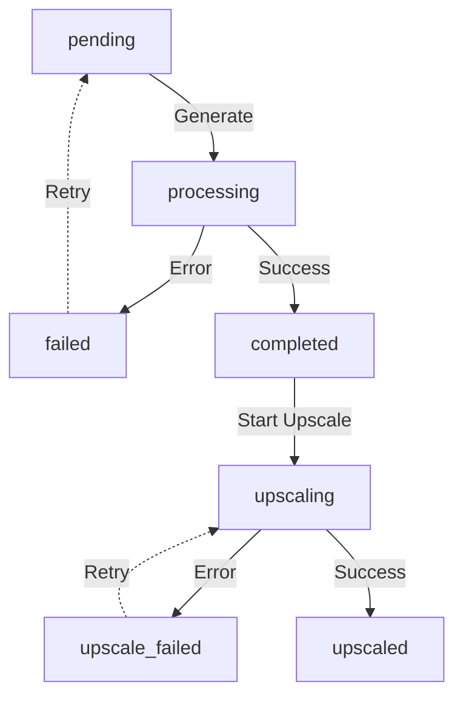

# Video Generation State Machine Refactor

> Created: 2026-04-10
> Status: Implemented

## Summary
Refactor the state machine for video generation and upscaling to use a purely 1-dimensional state model. This removes the conflated use of `status` alongside the `is_upscaled` boolean flag and null-checks on `video_url`, ensuring a robust, predictable state transition path across the backend and frontend.

## Problem Statement
Currently, the system uses a single `failed` status for both primary video generation failures and secondary upscaling failures. To distinguish between the two on the frontend (e.g. Batch Action Studio), developers must resort to hacky checks like checking if `video_url` exists while `status === 'failed'`. Meanwhile, the individual shot view (`ProfessionalEditor.vue`) strict-checks `status === 'completed'`, immediately hiding action buttons like "Upscale" or "Add to Media Library" if an upscale task fails, despite the original video still being viable. 

Also, a successful upscale is tracked using `status = 'completed'` combined with a boolean flag `is_upscaled = true`, complicating Vue conditional renderings.

## Research Findings

### Codebase Patterns
- `domain/models/video_generation.go`: Existing statuses are `pending`, `processing`, `completed`, `failed`, `upscaling`. Also has an `IsUpscaled *bool` column.
- `application/services/video_generation_service.go:614`: When upscaling completes, it manually flags `updates["is_upscaled"] = true` while keeping the status as `completed`.
- `application/services/video_generation_service.go:660`: `updateVideoGenError` blindly forces `models.VideoStatusFailed` on any failure, wiping out information that it was an upscale failure.
- `web/src/components/editor/BatchGenerationDialog.vue:266`: Workaround logic: `const failedWithBase = vidRes.items?.find((v) => (v.status === 'failed' || v.status === 'error') && (v.video_url || v.local_path))`
- `web/src/views/drama/ProfessionalEditor.vue:1717`: Hardcoded check `v-if="(video.status === 'completed' && !video.is_upscaled) || video.status === 'upscaling'"` forcing buttons to disappear on upscale failures.

## Proposed Solution

### Approach
Transition to a purely linear state machine model.

### Technical Details
1. **Backend Model Updates**: Extend `VideoStatus` in `models.VideoGeneration` to include `VideoStatusUpscaleFailed` (`"upscale_failed"`) and `VideoStatusUpscaled` (`"upscaled"`).
2. **Backend Logic Refactor**: Modify `completeVideoGeneration` and `updateVideoGenError` to correctly transition to the new states rather than falling back to `completed/is_upscaled=true` or `failed`.
3. **Frontend Component Simplification**: Rip out all complex `is_upscaled` boolean logic. Replace fallback logic in Vue components with clean, direct matches against `upscaled` and `upscale_failed`.

## Acceptance Criteria
- [ ] Backend accurately tags videos as `upscaled` instead of using `is_upscaled` boolean matching.
- [ ] Backend accurately tags videos as `upscale_failed` upon upscale failure, keeping the video URL intact.
- [ ] The `ProfessionalEditor.vue` displays the "Upscale"  buttons properly on shots with `upscale_failed` condition.
- [ ] The "Add to Media Library" button remains visible regardless if the upscale succeeded or failed, so long as the base video is completed.
- [ ] The `BatchGenerationDialog.vue` maps the new states accurately to progress and UI text tags without relying on `.video_url` existence checks for `failed` nodes.

## Technical Considerations

### Data Migration (Backwards Compatibility)
A brief migration run is needed on existing database records to avoid breaking old videos.
- **Query 1**: Set `status = 'upscaled'` where `status = 'completed' AND is_upscaled = true`
- **Query 2**: Set `status = 'upscale_failed'` where `status = 'failed' AND (video_url IS NOT NULL OR local_path IS NOT NULL)`

### Dependencies
No new dependencies are needed. Standard GORM modeling and Vue refactoring.

### Risks
- Overlooking a random `.is_upscaled` check in another deep UI folder may temporarily break rendering functionality there.
- Existing background tasks mid-flight during the deployment might end up in a slightly ambiguous state unless handled smoothly.

## Implementation Steps

Tasks tracked in local checklist or via `/work`:
- Task 1: Update Go enums (`VideoStatusUpscaleFailed`, `VideoStatusUpscaled`) in `video_generation.go`.
- Task 2: Refactor `updateVideoGenError()` to detect if previous state was `upscaling`. If yes, fallback to `upscale_failed`. Else `failed`.
- Task 3: Refactor `completeVideoGeneration()` to save state as `upscaled` if previous state was `upscaling`.
- Task 4: Fix `ProfessionalEditor.vue` template conditionals for video actions. Replace `is_upscaled` references with `status === 'upscaled'`. Add `upscale_failed` to logical OR handlers for action visibility.
- Task 5: Refactor Vue script tags in `BatchGenerationDialog.vue` and `BatchReferenceVideoStudio.vue` to rip out the `failedWithBase` hack logic and simplify to 1D status checking.
- Task 6: Supply raw standard SQL patch / migration script to the user to resolve existing dirty data.

## References
- Internal discussion on state machine modeling for AI pipelines.
